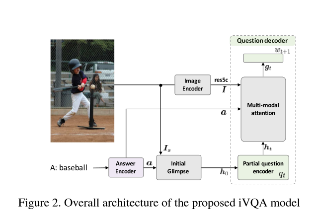
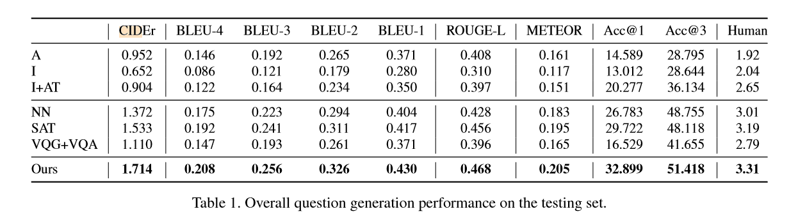

## iVQA: Inverse Visual Question Answering

### 1. Abstrat

不同于传统的 VQA 任务，本文通过引入 iVQA 任务，即通过给定图片和回答输出对应的问题，因为回答相对于传统的问题缺失了很多的信息并且学习的偏差比较大，所以在 iVQA 任务上的学习必须要比传统的 VQA 更好的对输入进行理解，提高模型的推理能力。

### 2. Introduction

最近的 VQA 任务的研究发现，目前的模型算法的成功主要依赖于问题给出的提示和数据集之间的偏差，模型几乎很少的试图去学习理解图片（不提供图片一样给出回答，不同图片同样的问题回答一样，模型和人类在图片上的观察重点很不一样）。目前 VQA 算法模型的主要在于依赖于探索标签之间的差异性而不是在试图理解图片本身。

iVQA 任务的目的在于试图根据输入的图片和回答推测问题是什么。新的问题环境设置的好处在于

1. 问题可以提供的对于学习的偏差更少，更加难以学习，最好的方式就是通过理解图片得到答案(这也是作者的目的所在)
2. 回答本身的信息和提示比问题提供的要少很多，这让 iVQA 任务比起 VQA 任务更加的困难，会让模型更试图通过理解图片来预测问题是什么
3. iVQA 会学习到更加灵活复杂的推理策略

但是目前的 VQA 的解决方案并不适用于 iVQA，解决这个新提出的问题的核心在于模型生成对应的问题的时候需要有选择动态的关注图像上的不同的区域（这里使用了针对回答和目前部分生成的问题上的 multi-model dynamic attention 策略）。

在评测阶段，传统的基于词重叠的评价指标比如 BLEU 等等对于该问题的描述并不是准确的，所以作者提出了新的基于 rank-based 的评价指标，这个指标通过利用 iVQA 模型在 ground truth 问题和其他的候选问题之间进行排序进行评估，同样也使用了人类的评价指标作为参考。

文章组织

1. 提出 iVQA 问题
2. 提出针对 iVQA 问题的 multi-model dynamic attention based model
3. 提出了基于 rank-based 的评测指标
4. iVQA 对于提升 VQA 的效果有一些帮助

### 3. Related work

和 iVQA 任务最相似的任务就是 VQG 任务，该任务的目的在于根据输入的图片输出一个问题，但是因为 VQG 并不需要在回答的基础上生成，通常会生成大量非常 general 或者一些令人困惑的问题。

### 4. Methodology

#### 4.1 Problem formulation

$q*=\max_qp(q|I,a;\Theta)$

$I$ 是图片，$a$ 是问题，$q$ 是问题，也可以看作是词序列 $(w_1,w_2,...,w_n)$ ，$\Theta$ 是模型的参数

#### 4.2 Model overview

总共存在有 3 个子网络

* image encoder

  CNN 抽取图片的全局和局部特征，局部特征是使用 ResNet-152 对每一个 14 * 14 的局部信息抽取出 $I=\{v_{ij}\}$ ，$I\in \mathbb{R}^{2018 \cdot 14\cdot 14}$的局部信息，$v_{ij}\in \mathbb{R}^{2048}$。全局特征是 $I_s\in \mathbb{R}^{1000}$ 是使用的数据集中该图片的常见的 1000 个语义概念作为图片全局的语义信息。

* answer encoder

  LSTM with 512 cells （final state concate with cell state 1024 dimensions）提供 encode 表示

* question decoder

  LSTM based on images and answer encode

**Dynamic multi-model attention**

iVQA 和传统的 VQA 模型不一致，需要对 attention 进行独特的设计

1. Initial glimpse

   对输入的 image 和 answer 建立一个简单的印象，从而对解码确定一个好的起点。通过使用语义预测 $I_s$ 以及编码的 $a$ 问题的文本作为两个辅助决定生成的问题的初始词是什么。

   $h_0=\delta(W_{ih}I_s + W_{ah}a)$

   其中两个 $W$ 是 embedding 矩阵，$\delta$ 是 $\tanh$ 激活函数。

2. Encoding of partial question

   利用之前解码的部分生成的问题 $q_t=\{w_1,w_2,...,w_t\}​$ 生成下一个对应时间布状态

   $h_t,m_t=LSTM(x_t,h_{t-1},m_{t-1})$ 

3. Multi-model attention network

   $z_t=ReLU(W_qh_t+W_a a)$

   生成部分的QA文本向量 $z_t$
   $$
   f_{ij}=\delta(U\delta(W_v v_{ij})⊙\delta(W_zz_t))\\
   \alpha_{ij}^t=softmax(p^T[f_{ij}])\\
   c_t=\sum_{ij}\alpha_{ij}^tv_{ij}
   $$
   利用 MLB 方法结合局部信息和 $z_t$ 生成图片空间上的混合特征 $f_{ij}$ ，最后根据 softmax 生成对应的 attention 权重，利用权重生成对应的上下文向量 $c_t$

   $g_t=\delta(U'\delta(W_cc_t))⊙\delta(W'_zz_t)$

4. Word predictor

   使用 softmax 作为分类器预测下一个词生成的概率分布

   $w_{t+1}\backsim softmax(W_og_t)$

### 5. iVQA Evaluation

主要考虑了三种评测指标，传统的词重叠指标，排序指标，人类评价指标

重点是 iVQA ranking-based 指标

针对 $(I,a)$ 的输入，指标是 $p(q|I,a;\Theta)$，如果 ground truth 指标通过这个概率被给予了最高的分数可以认为是正确，给予 Rank-1 。对于 iVQA 的评测指标就可以理解成为 Rank-1 的平均次数和概率。或者说是 Rank-3 (ground truth in Top-3)。

### 6. Experiment

针对 iVQA 利用 MS  COCO 构建了新的数据集，包含有 82783 训练集，5000 验证集和 5000 测试集。

作者认为 iVQA 可以帮助 VQA 任务更好的理解问题和图像的含义，首先单独的 VQA 的实验在验证集上的精度是 57.85 通过使用了 iVQA 输出的结果作为新的信息，精度提高到了 58.86。