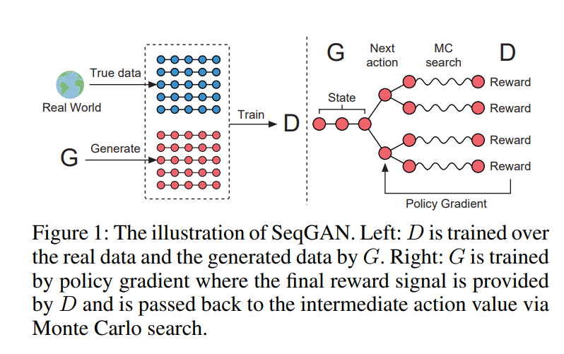
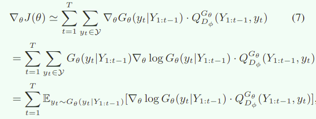
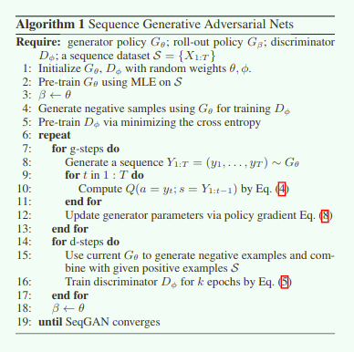

# SeqGAN

---

### 1. Abstract

传统的 GAN 在面对离散的问题的时候是非常困难的，因为在 NLP 的离散性 discriminator 没有办法把修正的梯度传递给 generator ，所以会出现训练困难的问题。

本文通过利用策略梯度算法避开了这个问题，讲强化学习和 GAN 结合在一起实现了对于 NLP 问题的序列生成算法。

### 2. Introduction

传统的对于句子生成的方式中，使用的循环神经网络 RNN / LSTM 等等对于生成序列数据非常有效，但是经常在面对实际应用中会出现一个问题就是，在测试的时候面对不存在于训练集中的数据经常会出现预测错误并且这个问题随着序列的长度增加而严重，为了解决这个问题，bengio 提出了 **scheduled sampling (SS)** 的思路，在预测下一个生成的 token 的时候，按照概率部分的使用生成的上一个 token 作为输入或者使用真实的训练数据 token 。但是这个方法并不是很好，不具有一致性。另一种解决思路就是对整个生成句子采用一个评价指标，比如 BLEU 作为损失进行训练，但是这样的评价指标有时候并不具有良好的准确性。但是作者认为 GAN 可以缓解这个问题。

但是使用 GAN 应用在 NLP 领域存在有两个主要的问题

1. GAN 适合生成连续的数据，但是并不是很适合生成离散的数据

   因为 GAN 的主要思路在于使用 D 对 G 的修正指导的前提是 G 的修正是轻微的，但是在 NLP 任务的字典中，可能并不存在这么 token 使得改变是轻微的。

2. GAN 只能对完整的句子进行打分，因为部分句子的评估分数是不合适的

在本文中，讲序列生成问题重新考虑城市时序决策过程。生成模型可以考虑成是强化学习的 Agent，状态是当前目前生成的 tokens，动作是下一个生成的 token。但是和之前的一些方法的评价指标不同，这里使用 D 作为评价指标指导对 RL Agent (generator) 的学习。因为生成器是一个参数化的策略，所以使用策略梯度算法和 MC Search 搜索状态动作函数 Q ，使用策略梯度的方式就可以避免 GAN 中对于离散问题的微分困难的问题。

### 3. Related work

正如 (Bachman and Precup 2015) 指出的，序列数据生成可以被形式化的描述成序列决策过程，也就是说这种序列数据生成的方式可以使用强化学习来进行实现，这种方法建模序列生成器成为一个选择下一个生成单词的概率，策略梯度算法可以用来进行优化，但是这里需要注意必须要有显式的 reward 的定义。在本文中，使用 RL Agent 替换 GAN 的生成器，使用通过 MC Search 为基础的判别器作为奖励信号，也可以达到很好的效果。

### 4. SeqGAN

生成器模型如下 $G_{\theta}(y_t|Y_{1:y-1})$ 是随机的并且，对于状态转移概率来说，所有的状态转移概率都是 1 只要我们指定了转移的动作，其他的转移的动作都是 0.并且训练一个 $D_{\theta}(T_{1:T})$ 指示一个序列 $Y_{1:T}$ 和真实数据的相似程度。在训练过程中, $D$ 为 $G$ 提供了一个指示的奖励，正数代表是从真实数据获取的，负数代表是合成的数据。同时，$G$ 使用策略梯度算法和 MC Search 进行搜索。

#### 4.1 SeqGAN with Policy Gradient

当没有中间奖励的时候，使用策略梯度算法 $G_{\theta}(y_t|Y_{1:t-1})$ 作为一个生成器(策略 Policy)需要生成一个完整的序列。如下面的公式就是计算对应的目标函数。
$$
J(\theta)=\mathbb{E}[R_T|s_0,\theta] = \sum_{y_1\in \mathbb{Y}}G_{\theta}(y_1|s_0) \cdot Q_{D_{\phi}}^{G_{\theta}}(s_0, y_1)
$$
在本文中，对 Q 函数的估计使用的是 REINFORCE 算法，使用无偏的 $D$ 判别的是真实数据的概率作为奖励信号。

$Q^{G_{\theta}}_{D_{\phi}}(a=y_T,s=Y_{1:T-1})=D_{\phi}(Y_{1:T})$

因为 D 考虑是长期的奖励和，中间过程的奖励是稀疏的。为了解决这个问题，文章使用了 MC Search 加上 roll-out 的策略 $G_{\beta}$ 采样位置的后面的 $T-t$ 个 tokens
$$
\{Y^1_{1:T},...,Y_{1:T}^N\}=MC^{G_{\beta}}(Y_{1:t};N)
$$
其中 $Y_{1:t}^n=(y_1,...,y_t)$ 是之前的已经存在的采样过的数据，$Y_{t+1:T}^n$ 是之后 roll-out 到结尾的采样数据，在这里采样器 $G^{\beta}$ 就是 generator 但是如果为了加快速度的话这里可以做简化，就和 AGZ 一样。一批 roll-out 过程一直持续到模拟对话的结束，计算这一批的奖励平均值。
$$
Q_{D_{\phi}}^{G_{\theta}}(s=Y_{1:t-1},a=y_t)=\left\{\begin{array}{cc} 
		\frac{1}{N}\sum_{n=1}^ND_{\phi}(Y_{1:T}^n),Y_{1:T}^n\in MC^{G_{\beta}}(Y_{1:t;N}), &for\ t < T\\ 
		D_{\phi}(Y_{1:t}), & for\ t=T 
	\end{array}\right.\tag{4}
$$
对 $D$ 的训练过程如下
$$
\min_{\phi}-\mathbb{E}_{Y\backsim p_{data}}[\log D_{\phi}(Y)]-\mathbb{E}_{Y\backsim G_{\theta}}[\log(1-D_{\phi}(Y))]\tag{5}
$$
每一次获得了更好的生成数据的时候，都可以使用上面的式子对 $D$ 进行重新训练。

对 $G$ 的训练过程如下
$$
\nabla_{\theta}J(\theta)=\sum_{t=1}^T\mathbb{E}_{Y_{1:t-1}\backsim G_{\theta}}[\sum_{y_t\in Y} \nabla_{\theta}G_{\theta}(y_{t}|Y_{1:t-1})\cdot Q_{D_{\phi}}^{G_{\theta}}(Y_{1:t-1,y_t})]
$$
上述的式子可以使用利用无偏估计重新编写。

转化成了标准的策略梯度的形式
$$
\theta\leftarrow \theta + \alpha_h\nabla_{\theta}J(\theta)\tag{8}
$$

#### 4.2 Algorithm

在训练之前，使用 MLE 预训练了 $G_{\theta}$ 以及预训练了 $D_{\phi}$ 然后执行后续的算法

### 5. 序列生成模型

生成模型使用的是 RNN ，最后在隐含曾上添加了 softmax 进行分类，论文中实验使用的是 LSTM，所有的 Seq2Seq 模型的变体都适用于 SeqGAN，只要最后输出的是概率分布就可以作为生成的策略使用

### 6. 序列判别模型

论文中使用 CNN 作为判别器，这里的判别器的作用在于判别一个完整的生成的句子是否是真实的。

输入句子首先被映射成为一个输入矩阵
$$
X=x_1\oplus x_2\oplus...\oplus x_T
$$
每一个 $x_t$ 代表的是 token embedding ,$\oplus$ 代表是级联符号。然后即使标准的 CNN ,模型也使用了惨差架构，最后的使用 sigmoid 函数映射输出概率。优化目标是交叉熵。