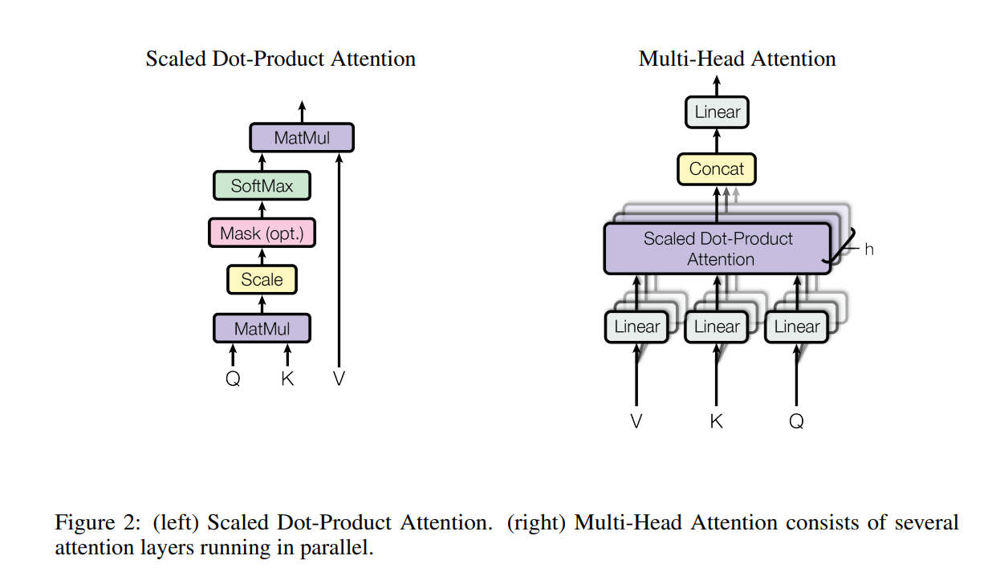
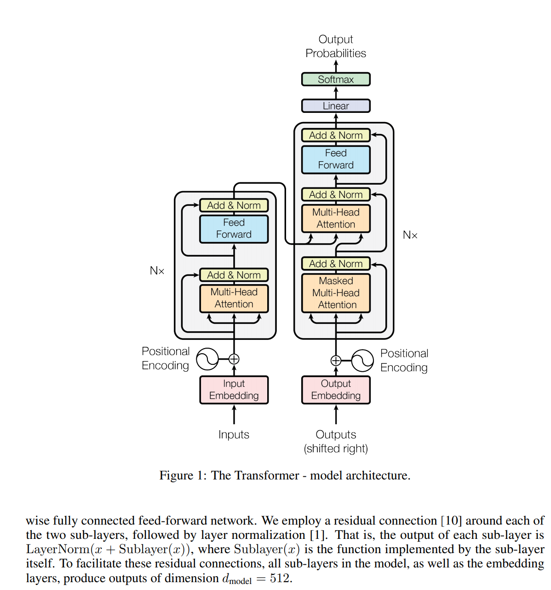

# Attention is all you need

本文统一使用一个 self-attention 架构解决序列转换问题，其中的核心在于attention中的三个概念

* Q: query 
* K: key
* V: value

三个都是向量表示的，其中最终的计算结果是value的权重加和，关于value的权重是通过Q和K计算出来的

---

缩放点积attention和multi-head attention是核心

* softmax 获得最终的权重

* 公式: $$\rm Attention(Q,K,V)=\rm softmax (\frac{QK^T}{\sqrt{d_k}})V$$

* 实验结果证明缩放 $$\sqrt{d_k}$$ 在 $$d_k$$ 很大的时候效果很好，原因是因为大的维度导致最终计算的结果很大，容易导致softmax进入梯度小的范围内

* 多头注意力公式: 
  $$
  \rm MultiHead(Q,K,V)=Concat(head_1, ...,head_n)W^O \\
  head_i = \rm Attention(QW_i^Q,KW_i^K,VW_i^V)
  $$
  其中 $\rm W_i^Q\in \mathbb{R}^{d_{model}\times d_k}, W_i^K\in \mathbb{R}^{d_{model}\times d_k},W_i^V\in \mathbb{R}^{d_{model}\times d_v}$

  本文中使用了8个头，其中$d_k=d_v=\frac{d_{model}}{h}=64$

* $\rm d_{model}$ 是512的词向量

整体架构图

* 在 decoder 阶段中，encoder最终的block中计算得到的结果作为self-attention的$K,V$
* $Q$查询矩阵由decoder提供

