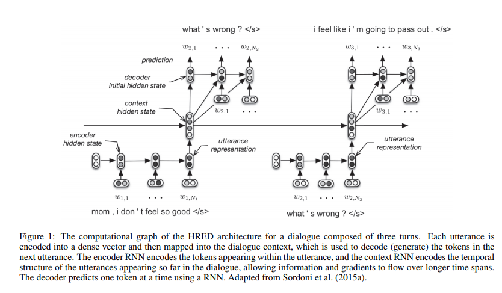

## Building End-to-End Dialogue Systems Using Generative Hierarchical Neural Network Models
---

### 1. Abstract

应用了 HRED 算法到开放领域的多轮对话系统中，并且取得了非常好的效果，文章最终还展示了方法的限制以及如何通过数据引导的方，利用大量额问答对的语料和预训练的词向量提升性能。

### 2. Introduction

1. 本文主要聚焦于开放领域对话，主要原因在于语料库非常的充分。但是方法对于任务导向对话是一样适用的

2. 传统额的任务导向对话系统最成功的方法就是将对话任务建模成 POMDP ,但是实际上因为任务导向对话系统中使用的都是认为标注的任务相关的语料和特征并且需要有一群人乐意和这样的对话系统交流提升性能，这样的工作是耗费时间的。

3. 开放领域对话语料库充足，并且可以用来训练任务导向对话中的 POMDP 中的 user simulator，这对于将开放领域对话系统泛化到任务导向对话有这重要的意义。

4. 本论文的工作在于端到端，无任务导向的生成式对话模型，生成式对话任务可以视为是建模语句和对话结构。这样的对话 agent 学习了语言理解，推理，决策， 语言生成试图去模仿训练集中的数据。算法不需要任何的手工定义的状态都是从语料库中隐含学习的，并且使用的是 human-human 对话数据集，不需要耗费大量的时间像任务导向对话那样 human-machine 对话。

   算法对数据的依赖性比较高。

5. 算法使用 HRED(hierarchical recurrent encoder-decoder) 模型

### 3. Related Work

### 4. Models

对话: $D=\{U_1,...,U_M\}$ , $M $ 是对话轮数

对话: $U_m=\{w_{m,1},...,w_{m,N_m}\}$ 其中 $N_m$ 表示对话中的 token 的数目

对话生成概率
$$
P_{\theta}(U_1,...,U_M)=\Pi_{m=1}^MP_{\theta}(U_m|U_{<m})=\Pi_{m=1}^M\Pi_{n=1}^{N_m}P_{\theta}(w_{m,n}|w_{m,<n},U_{<m})
$$
这个过程类似于语言模型的学习过程。

---

#### HRED

和传统的 HRED 一致，这里假设，一个对话可以被视为是语句的序列也可以看作是 token 的序列

1. encoder RNN 将语句映射成语句向量 utterance vector (当前 utterance 最后的隐含层向量输出)
2. context RNN 将过去的每一个 utterance vector 迭代处理，生成的隐含向量表示的是对话目前的状态总结，可以阿奎那做是连续实值的对话状态空间，用来预测下一个对话生成。
3. decoder RNN 预测下一个对话语句的生成，将 context RNN 的输出作为输入产生下一句话的 token 生成的概率分布。和传统的 seq2seq decoder 一样的含义只不过是建立在 context RNN 的基础上。
4. 论文中所有的 RNN 单元都是用 GRU 生成，tanh 作为激活函数， encoder decoder 参数共享。

HRED 比传统的 seq2seq 效果的好的主要原因在于

1. context RNN 允许模型表示对话的主题和共同的概念，这对于构建一个成功的对话系统是非常重要的
2. 因为 context RNN 拉近了长期以来，计算量降低，训练稳定。

#### BiHRED

1. HRED 中，对话表示是用 encoder 实现的，但是这对于对话环境可能并不是非常的适用，对话中需要更加复杂的句法结构，所以使用 BiHRED 是一个非常值得尝试的选择。

2. 最终的 encoder RNN 的隐含输出结果

   * 级联输出给 context RNN

   * 对所有时间步的隐含输出的时间维度施加 L2 池化，然后级联
     $$
     \sqrt{\frac{1}{N_m}\sum_{n=1}^{N_m}h_n^2}
     $$

#### Bootstrapping from Word Embedding and Subtitles Q-A

1. word embedding 确保可以学习到 token 的充分语义信息
2. 预训练语言模型在一个大的对话语料库上，使用的是 1-A SubTle 语料库，在这个语料库的基础上构建了简单的一轮 Q-A 对话语料库进行预训练。

### 5. Conclusion

1. 使用大量的语料库初始化的 word embedding 很好
2. 使用相关不是对话的预训练语言模型可以很好的提升效果
3. 都是用困惑度进行评价
