# Conclusion of the Dialogue

> Main content of the paper
> 1. motivation
> 2. proposed
> 3. details
> 4. next step

---
## 1. DDQ
1. motivation  
   传统的解决 RL 的非常消耗资源的方式是使用 user simulator 但是 user simulator 对我们的任务的环境并不是非常的贴切的，并且缺少语言上的多样性，从而降低性能。并且目前对 user simulator 没有一个具体的评价指标，无法对环境的有效性进行衡量。
2. proposed  
   Deep Dyna-Q 结构，使用 model-based 算法减少对环境的依赖性，维护一个 world model,对话 agent 使用真实经验和生成的模拟经验共同进行优化。
   真实的用户经验并不是很多，但是因为尝试学习 world model 所以可以使用模拟的经验重复学习。
3. details
   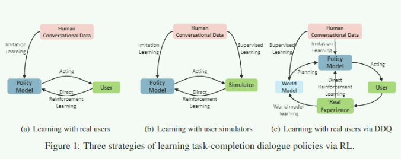
   1. 真实的用户经验可以用来提升 world model 也可以用来直接提升对话策略
   2. world model 是一个简单的 MLP 之后用来预测下一个用户的响应动作，奖励值，对话终止记录。
   3. 如上图所示，首先会和真实的用户进行一轮对话，利用对话信息优化 world model 和对话策略，之后使用 k 步的虚拟对话策略生成一些虚拟对话样本，利用虚拟对话样本优化策略。
4. next step
   1. 虚拟对话在训练后期的影响很大，所以有了一种新的优化方法 D3Q 
   2. 论文中的思路非常好，通过对人力和 user simulator 之间的折中使得可以在人力可负担的范围内训练好的对话 agent

---
## 2. D3Q
1. motivation
   这篇论文的工作是在之前的 DDQ 论文的基础上继续的，上一篇的 DDQ 中使用了 model-based 的方法对对话策略进行学习，虚拟的对话样本在早期大量的模拟经验是一种好的策略，但是虚拟的对话样本质量不是很好，这一点在训练的后期对 agent 的效果的影响很大。
2. proposed
   受到 GAN 的启发，通过将 discriminator 整合到 DDQ 的架构中，让 world model 学会区分真实经验和模拟的经验，推动虚拟的样本经验想着真实的经验的方向去发展。只有好的虚拟样本经验，那些不能被简单的被 discrimintor 区分出来的将会用来对对话策略进行进一步的学习
3. details
   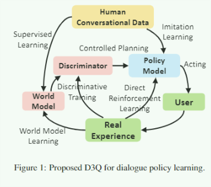
   架构图如上所示，在原来的 DDQ 的基础上通过 discriminator 的作用让生成的虚拟的样本的效果变得更好。
4. next step
   1. 作者将 DDQ, D3Q 看作是典型的 model-based RL 的方法，这类方法可以使用到其他的类似的任务中去

---
## 3. Agent-Aware Dropout DQN for safe and efficient on-line dialogue policy learning
1. motivation
   传统的 rule-based 的对话策略系统通常使用人为定义的规则但是不能很好的繁华泛化到别的领域，使用 data-driven 的 RL 是另一种学习对话策略的可行的方式，将双方的优势结合起来构建一个 companion learning framework 系统。
   在 companion learning framework 系统中，rule-based 的对话策略系统是 teacher, RL 对话策略系统是 student ,通过 teacher 提供的示例动作和示例奖励函数对 student 的策略学习提供指导。但是 rule-based 的系统并不是很好的，所以我们需要决定什么时候以及怎么样让 student 请求 teacher 的指导。
2. proposed
   论文中提到了一个有趣的例子解释这个问题，一个新的客服人员如何开始的，首先有经验的客服会交给他一些规则，之后客服人员自己通过不断的和客户的交流之后提升了自己的信心。在这里，文章引入了不确定性(信息)来决定什么时候进行教学。这里使用的 dropout 来对不确定性进行建模。通过运行 N 次过程之后得到了 N 个不同的 Q 值，方差就体现了不确定程度。但是这样并没有一个确定的衡量阈值的标准，所以通过 N 次采样，记录对应的出现最频繁的动作及其概率，其中概率作为不确定程度的衡量，概率越大，越确信，越小，越不确信，从而在超过阈值的时候结束 teacher 的指导。
3. details
   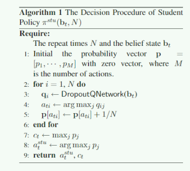
4. next step
   companion learning 的学习方式，在目前的任务中并没有一些明显的用处，但是使用 dropout 对不确定性进行建模的方式值得学习。

---
## 4. Learning End-to-End Goal-Oriented Dialog with Multiple Answers
1. motivation
   传统的对话系统的学习过程中，根据训练集中的数据设置，只会映射出一条对应的话语，但是实际上可能会存在有大量合法的输出，但是传统的对话学习并没有考虑到这一点。
2. proposed
   1. 提出了一个多种回复的对话数据集
   2. 针对这个问题引入新的方法(SL + RL)
   3. SL 训练过程中，强制让其只根据一部分的状态来对之后生成的 utterence 进行预测，让剩下的一部分状态的内容用来存储其他的合法输出的信息。这一部分使用掩码向量实现。
   4. RL 训练过程中，只要生成的最终句子是合法句子集中的一个句子就会给予奖励，让对话策略学习到多种回复。

3. details
4. next step

---
## 5. Towards and Automatic Turing Test: Learning to Evaluate Dialogue Response
1. motivation
   对对话系统的精确的自动评估是一个待解决的问题，传统的 BLEU 等基于重叠词的指标并不是很合理，主要是因为缺乏语义相似度。如果要使用真实的人的指标来尽心评估的话，耗费的人力很巨大，所以开发自动的对话评估系统就是一个很重要的问题。
2. proposed
   1. 训练一个模型预测人类对对话的评估打分
   2. 可以捕捉语义相似度，考虑了对话的上下文和参考回复。
   3. 输入上下文，参考回复，模型的真实回复之后，利用下面的公式计算评分  
       $$score(c,r,r')=(c^TMr' +r^TNr'-\alpha)/\beta$$
       其中 $c$ 是上下文向量，$r$ 是参考回复向量,$r'$ 是真实回复向量(统一使用RNN计算,参数与训练并不是学习的)。上面的公式的含义是 $M,N$表示空间映射，然后计算点积对相似度，语义相似度大的评分高。使用最终的 human score 进行监督训练。
3. details
   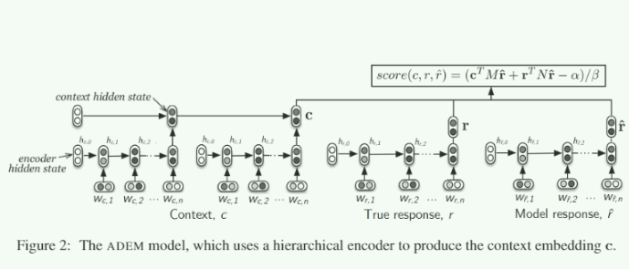
4. next step

---
## 6. Dialogue Learning with Human Teaching and Feedback in End-to-End Trainable Task-Oriented Dialogue Systems
1. motivation
   对话策略学习的离线学习(SL)和在线学习(RL)之间对话状态分布可能存在差异。
2. proposed
   1. 模仿学习
       离线的监督训练结束之后，让 agent 和真实的人类进行任务导向的对话。当agent出现错误的时候，我们请求人类用户纠正错误并作出正确的策略动作，这个数据就会加入到训练集中然后重新 SL 监督训练
   2. 强化学习
       因为模范学习相对非常的消耗资源，我们运行了模范学习之后，使用 RL 和用户交互学习用户的反馈即可，反馈仅仅在对话结束之后给出所以相对资源消耗不如模仿学习那么巨大。强化学习算法使用的 REINFORCE 的策略梯度算法。
3. details
   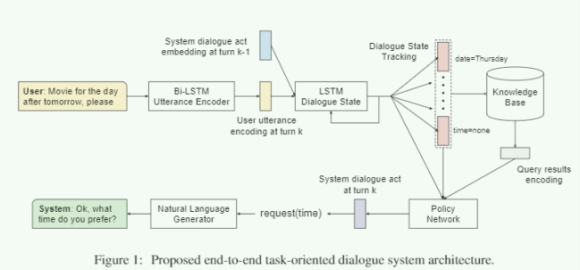
4. next step
   1. 这篇文章比较普通，但是对于传统的 pipeline 的对话流程介绍的非常细致，其中对于对话状态跟踪竟然使用的是传统的 LSTM 来进行学习，我觉得是一个适合作为教程的论文。

---
## 7. Sequicity: Simplifing Task-oriented Dialogue systems with single Sequence-to-Sequence Architectures
1. motivation
   在 pipeline 的对话系统中，belief tracker 是整个对话系统中非常重要的一部分(记录之前的对话状态,维持槽值的概率分布)。但是之前的传统的 belief tracker 都是使用的多分类器实现的，这样当 slot 的维度很大的时候，很容易面临学习困难的问题，而且不容易处理未登录词。
2. proposed
   作者使用传统的 seq2seq 的思路去解决，主要思想就是使用 seq2seq 预测类别标签，作者文中将这个标签成为 bspan 有点类似于我们的 html 代码里面的 `` 标签，这样的一个标签就表示了 belief tracker 要追踪的用户的其中提供的一些信息(slot)，并且使用这个生成的 bspan 去在外部知识库 KB 中查询并生成对应的结果。这里面包含了两个 decode 的过程，先 decode bspan 之后利用 decode 的 bspan 查询和 decode 生成的句子。作者认为第一步 decode 本质上就是 belief tracker
   $$B_t=seq2seq(B_{t-1}R_{t-1}U_t|0,0)\\
   R_t=seq2seq(B_{t-1}R_{t-1}U_t|B_t,k_t)$$
   上面的 $k_t$ 是第 $t$ 步的外部知识库查询结果，$B_t$ 是第 $t$ 步的 bspan，$R_t$ 是第 $t$ 步的系统回复, $U_t$ 是用户的回复。
   作者之后使用策略梯度算法更好的学习如何解码 bspan (解码对应的策略)奖励设置中，鼓励生成那些可以让用户主动请求信息的回复。
3. details
   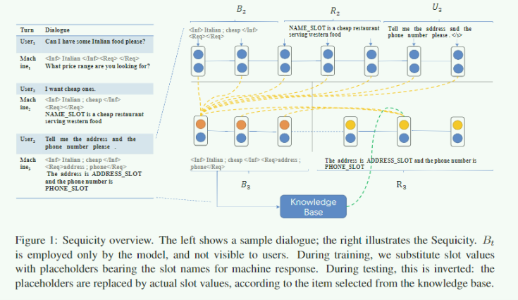
4. next step

---
## 8. Affordable On-line Dialogue Policy Learning
1. motivation
   创建一个可以通过和真实用户交互从而提高对话水平的 agent 需要满足两个条件 `safe, efficient` 但是实际上，因为缺失真实的对话数据，对话系统通常提升的非常缓慢。这样的对话系统的效果就会很差，从而导致更难获得资源。
   1. 一个可以负担的对话策略学习尽可能少的人类工作量
   2. 之前评估一个对话策略好坏的方式也是不合适的(仅仅从奖励曲线的情况入手)
2. proposed
   提出了 companion teaching (是不是很眼熟)策略解决 when and how to teach 的问题，也提出了两个用来衡量对话策略好坏的指标。
   1. companion teaching 组件: 机器对话管理器，人类用户，人类老师。人类老师提供奖励信息。
   2. 对于 when 的问题，之前的策略都是使用不确定的程度，一般都是 DQN 结果的最大 Q 和最小 Q 的差作为不确定的一个指标(重要性，不确定)，本文作者提出了 FPT (错误预测指标)，预测是否会失败，在对话失败的时候对人类导师进行求助。预测的方法使用的是 Multitask DQN ($Q^{turn},Q^{succ}$)如果 $Q^{succ}$ 很小的话，对话很可能失败(文章中使用的是平缓估计的方式进行预测)
   3. risk index:风险的大小(成功率小于阈值的程度)和持续时间的积分
   4. Hitting time:到达满意的效果的时间
3. details
   5. `safty`: 初始策略差。无法吸引用户
   6. `efficiency`: 训练效率不高，提升很缓慢，无法吸引用户。
       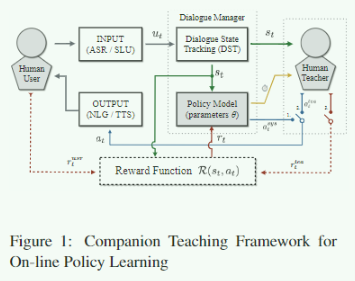
4. next step
    1. 请人来做实验真的这么容易么
    2. 和上面的一篇思路一脉相承，但是这个明显 low
    3. 对我而言应该是没有什么指导意义的

---
## 9. Structed Dialogue Policy with Graph Neural Networks
1. motivation
   传统的 DRL 对策略学习会出现样本利用率很低的问题，传统的方法都是通过使用更好的 RL 算法来实现，但是这里本文提出了一种互补的解决方案，使用图网络。图网络更适合于对话策略的学习，并且可以和现有的很多的 DRL 方法进行结合。目前的大多数的 DRL 的方法没有利用 belief state 和 action 的结构化信息。以 DQN 举例，传统的 DQN 使用全连接层，但是这里我们使用 GNN。
2. proposed
   图含有两种节点，一种是槽相关节点一种是槽无关节点。
   1. Input Module
       MLP 对 belief state 构建初始的隐含状态，其中类型相似的节点使用的映射 MLP 是一样的。
   2. Communication Module
       聚合和更新过程。
   3. Output Module
       输出映射。
3. details
   1. 对话状态管理是对话系统的核心，其中包含有两个主要的因素，分别是对话状态保持和对话策略响应
   2. 其中对话策略响应需要一个条件就是对可能的状态的分布的维护
   3. 对话 belief state 的定义是，存在一个用户希望构建 query 的槽和值得集合，belief state 在和用户的对话期间，对每一个槽的候选值的概率分布的维护。最大的 belief 槽信息会用来进行 KB 查询。对话状态可以看做是槽相关的概率分布(每一个槽一个概率分布)的级联以及和一个槽无关的概率分布的级联(KB结果的概率分布)
4. next step
   1. 引入一个可以替换的组件，使用 GNN 的效果在论文中进行了验证，GNN 可以作为一种新的考虑。

---
## 10. Preserving Distributional Information in Dialogue Act Classification
1. motivation
   本文和传统的对话任务的关系并不是很大，这篇文章主要聚焦于传统的 seq2seq 任务中最后解码的时候使用的是确定性的 token 进行解码的，但是确定性的解码会出现 label bias 和 error propagation 的问题，为了缓解这个问题,bengio 2015 提出了 schedual sampling 的概念但是工作的并不是很好。
   本文的主要任务点是序列标注
2. proposed
   显示的建模了 decode 过程中的不确定度，并且使用当前的方法对对话中的 dialogue act 序列进行预测。提出了两种方法，只看懂了第一种方法，第一种方法对不确定度的建模是这样的。
   $$p_{\theta}(z_t|x_{1:t})=\sum_{z_1,...,z_{t-1}}p_{\theta}(z_{1:t}|x_{1:t})\\
   =\sum_{z_{t-1}}p_{\theta}(z_t|z_{t-1},x_t)p_{\theta}(z_{t-1}|x_{1:t-1})$$
   使用动态规划的方法可以求出对应的值。
   $$L=\arg\min_{z'}p_{\theta}(z_t|x_{1:t})loss(z_t,z'_t)\\
   loss(z_t,z'_t)=0_{z_t=z'_t}$$
3. details
   序列标注(DA预测)
   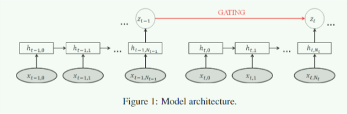
4. next step

---
## 11. ISO-Standard Domain-Independent Dialogue Act Tagging for Conversational Agents
1. motivation
   目前针对 open-domain 的 diagoue act 预测的 ISO 标准的数据集很少，并且不能直接拿来使用。
2. proposed
   为了解决这个问题，文章使用了一些预处理的方式将很多 in-domian 的数据集合并成了一个 ISO 标准的子集数据集，并在上面运行了一些现有的 dialogue act 预测的算法(SVM, HMM, ...)
3. details
4. next step

---
## 12. AliMe Chat: A sequence to Sequence and Rerank based chatbot engine
1. motivation
   一般的开放领域对话，都需要 IR model 和 对话生成器，前者经常会遇到 lont-tail(KB中找不到对应的查询的DA数据) 问题，后者经常会出现回复没有含义的情况。
2. proposed
   将 IR 和 seq2seq 结合起来
   1. 使用 IR 模型 (BM25 IR 方面的算法，没有细看) 抽取出对应的 QA 对
   2. 对用户提出的 q 将所有的匹配 a 构建(q, a) 计算分数，评分函数也是用 seq2seq with attention
   3. 分数超过阈值输出，没有超过阈值，使用生成器的输出 seq2seq with attention
3. details
   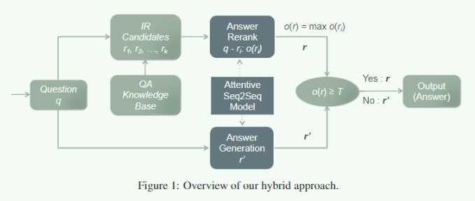
4. next step
   1. 很工程化的实现

---
## 13. Towards Implicit Content-Introducing for Generative short-text conversation systems
1. motivation
   传统的 seq2seq 因为不可控，生成的文本中的含义和多样性相对来说比较差。新的 content-intrducing 的方法看上去可以解决这个问题，但是 content-introducing 使用 cue word 是必须要出现在生成的句子中的，效果不是很好。
2. proposed
   通过将 cue word (辅助词) 的语义信息加入到生产过程中以及新的门控循环单元，参考 cue word 的词的含义生成更有意义的话。
   1. PMI: 点态互信息，在自然语言处理中，常用来衡量单词之间的相关性
       $$PMI(x,y)=\log\frac{P(x,y)}{P(x)P(y)}$$
   2. cue word 的提取
       PMI 用来作为 cue word 预测的主要方法
       $$PMI(w_q,w_r)=\log\frac{p(w_q|w_r)}{p(w_q)}$$
       $$PMI(w_{q1},...,w_{qn},w_r)\approx \log\frac{\Pi_ip(w_{qi}|w_r)}{\Pi_ip(w_{qi})}\\
       =\sum_i\log\frac{p(w_{qi}|w_r)}{p(w_{qi})}=\sum_iPMI(w_{qi},w_r)$$
       cue word 就是
       $$C_w = \arg\max_{w_r}PMI(w_{q1},...,w_{qn},w_r)$$
   3. 融合 gate 
       
3. details
4. next step
   生成多样性的对话的一种新颖的方法，新的网络结构，PMI 点态互信息计算和查询的文本相关性最高的词作为生成的 cue word

---
## 14. Feudal Reinforcement earning for Dialogue Management in Large Domains
1. motivation
   RL 是学习任务导向对话策略的一种非常有前景的算法，但是在迁移到比较大的 domain 的时候，会受到维度的限制，使用 Feudal 进行分层的强化学习可以有效的减少动作空间的大小。传统的 HRL 分层强化学习中需要明确的制定(手工标注)任务的层次关系并且对子任务需要明确的奖赏。
2. proposed
   1. master policy: Fedual 过程显示的建模了对用户的信息的获取(slot-dependent)和满足用户的要求(dlot-independent)两种不同的策略
   2. worker policy: Fedual 之后再上面的限定的子集中寻找下一个动作。
3. details
   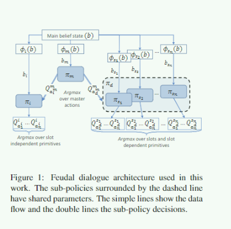
4. next step

---
## 15. Learning Symmetric Collaborative Dialogue Agents with Dynamic Knowledge Graph Embeddings
1. motivation
   传统的 pipeline 格式的对话系统中的对话状态是预定义好的，但是真实的对话状态可能会变得复杂的多。但是传统的端到端的架构中很难讲结构化的知识引入进去。为了结合两者，作者提出了使用知识图谱表示对话状态的方法。利用结构化的知识建模非结构化的对话历史信息(对话状态)。
2. proposed
   1. 作者提出了新的一种任务导向对话的设置环境，是一种类似于约束满足的对话环境，双方需要寻找相同的点(和目前的任务的目标很像，也和 deal or not deal 那篇论文的内容很像)
   2. 提出了 DynoNet 的新的架构，使用结构化的知识表示对话状态
   3. 对话模型的主要组成部分: 1. 动态的知识图谱表示了对话信息和响应的私有外部数据信息。2. 针对图中节点的 embedding 3. NLG
   4. 知识图谱中表示了实体之间的关系。知识图谱中存在有3种节点： item, attribute, entity 三种不同的节点，item是外部知识库中的一条内容，attribute 是对应的一条内容的属性,entity 是其中包含的实体。
   5. graph embedding
       $V_t(v)$ 表示的是节点的 embedding 表示了非结构化的信息和结构化的信息(KB)。主要由 KB 中定义的实体的关系，对话历史信息，周围邻居节点的信息。
   6. 主要的想法思路在于结合 端到端的解决方案和结构化的解决方案，使用 encoder, decoder  映射的时候替换传统的 word embedding 为一个包含了具体的知识图谱信息的映射，可以说知识图谱表示了对话的状态，尤其是解码的时候使用的 attention 的方式非常的别具一个，是对知识图谱上的所有节点做了 attention 对所有的节点计算一个权重。
3. details
   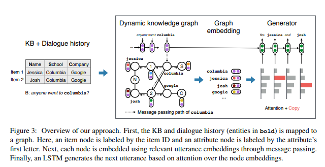
4. next step
   1. 使用知识图谱对对话状态进行建模是非常新颖的方法

---
## 16. Neural Belief Tracker: Data-Driven Dialogue State Tracking
1. motivation
   pipeline 的对话系统中非常重要的一个组件就是对话信念跟踪 belief track 目前的方法很难将对话状态的跟踪扩展到非常大和复杂的领域。作者总结原因主要有两点: 1. 训练 belief track 本身需要大量的标注数据 2. 需要手工的标注大量用户的语言变化的信息。
   作者提出了 NBT 基于预训练的词向量的语义信息来进行对话状态跟踪。新提出的方法不需要 domain 有关的大量手工数据标注。
2. proposed
   1. 预训练的有语义信息的词向量解决了词汇的不确定性
   2. 模型用来探测组成用户 goal 的槽和值在对话流中，需要的输入是上一轮的回复，本轮用户的回复，预测的一对槽值。使用过程中需要对所有的槽值进行迭代判断。
   3. 实际使用的是 DNN (建模了 n-gram 的 DNN) 或者是 CNN
3. details
   system response last time and slot-value make the gate for the utterence because 主要是为了应对 confirm 的情况，这种情况下，系统要求用户进行确认操作，这时候用户的输入不会是一个 slot-value 的形式，没有必要对 utterence 进行建模。
   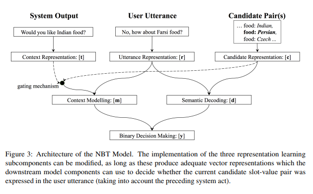
   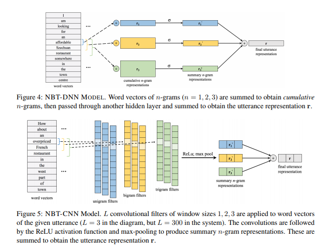
   完全使用的都是数据驱动的端到端的解决方案，通过预训练的词向量的语义相关性代替之前的手工标注数据进行训练，得到了很好的效果。
4. next step

---
## 17. Building Task-Oriented Dialogue Systems for Online Shopping
1. motivation
   新提出一个问题，在一个 online shopping 环境 setting 下的任务导向对话，并应用在大规模的服务上。在这环境设置下的主要问题就是电子商务需要大量的商品类别，因此这对于传统的 pipeline 方法是一个挑战，因为在 NLU 需要的大量的 domain expert 预定义的槽值。并且没有大量的数据集。领域规模问题 (domain scale) 外部知识库非常大，也是一个非常大的挑战。为了解决这个实际的问题，提出了自己的 pipeline 的方法和一些解决问题的途径。
2. proposed
   1. 解决数据集的问题，使用的是合作伙伴提供的数据，搜索记录，社区网站收集大量的数据。
   2. 系统的组成部分: NLU(识别出意图，查询物品的类别，查询的属性), Belief tracker, DM, PKB
   3. NLU 意图识别使用的是 用户搜索的数据(可以很好的体现出用户的意图) + LDA + 众包的标注
   4. NLU 用户查询物品的识别的任务被重新看做是对物品类别的分类任务，这样做可以大幅度的减少在 online shopping 环境下的搜索量。
   5. NLU 属性识别
   6. belief state tracking 是简单的规则
   7. dialogue management 也是简单的规则
3. details
   没有什么新意，知识简单的提出新的问题然后工程化的解决，工程性 > 创新性
4. next step

---
## 18. Training Millions of Personalized Dialogue Agents
1. motivation
   传统的 end-to-end 的对话参与性不高。主要在于缺乏一致性和主动参与对话的策略。传统的端到端的对话中发现，对对话系统进行任务角色的制定可以提高对话的参与度，论文中公布了新的有关角色和带有角色信息的对话的数据集。
   个性化的对话系统之前已经进行了一些研究，都是为了克服端到端的问题。之前的方法是引入学习隐含的用户的个性化表示或者是是明确的制定的结构化信息。使用简短的文本的话，是对用户友好并且是用户可编辑可控的。并且之前的工作证明，对 end-to-end 系统引入了个性化的机制后的确提升了对话的效果。
2. proposed
   通过使用较短的文本，对对话的 agent 进行制定是非常容易的。但是之前的工作的数据集是人工生成的。
   1. 个性化的人物角色是表示个性的句子的集合
   2. 系统是检索式而不是生成式
3. details
   数据集的格式
   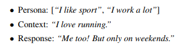
   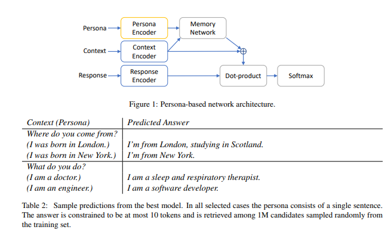
4. next step
   沿用了之前的方法，感觉贡献仅仅在于提出了新的数据集，boring

---
## 19. How to Make Context More Useful? An Empirical Study on Context-Aware Neural Conversational Models
1. motivation
   对话系统中使用上下文信息一种非常重要的方法，本文系统的对比了不同的将上下文信息建模的方法，并分析了上下文信息的重要性。然后提出一种新的方法对上下文信息建模，效果比之前的方法要好。这里主要是针对multi-turn 的长江下，需要将上下文信息建模到对话中去，现有的很多方法已经意识到了上下文信息的重要性，并提出了很多的 context-aware 的方法，但是之前没有一个系统的比较。
2. proposed
   1. 分层架构建模上下文信息更好，utterence-level 捕捉句子的含义，dialogue-level 的信息聚合了上下文的信息，介绍几种常见的分层的方法。
   2. 使用上下文信息可以辅助生成更长，信息更多，更加多样化的回复。
   3. sum pooling, concatenation, sequential integration, 
   4. 新提出的分层的方法(上下文和查询相关性的权重组合的方法)作者认为在上下文的句子中存在有和查询相关的和查询不相关的，不相关的是噪音，需要使用权重来显示的区分他们。
        * 使用余弦相似度计算上下文每一个 utterence 和查询的相关性
        * 类似于 attention 机制，按照相关性计算权重，最后按照一些方式组合构成文本向量用来 decode
        * 构成文本向量的方法 sum / concat 
3. details
   层次和flat的示意
   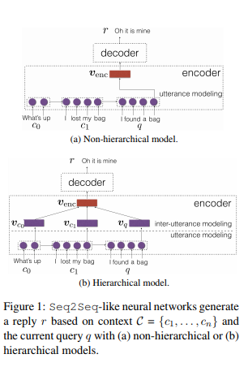

   四种分层的方法的示意
   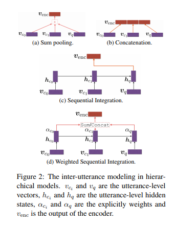

   上面的 `查询` 的概念是对外部数据库的查询操作得到的结果。
   作者最后的总结
   1. 使用分层结构
   2. 不要使用 sum 使用 concat
   3. 相关性权重很重要(新方法很好)
   4. 作者发现 seq2seq 架构需要很多的信息才可以生成更多的信息，context-aware 是必要的。
4. next step 
   1. 相当于综述的一篇文章，我认为很好，让我对 NLG 部分的有了一些更深刻的认识
   2. 相关性权重很有意思，attention is all you need, hahahaha
   3. attention 无论是在 graph embedding, soft KB query, context-aware generation 等等都很有用处，作为一个通用的思想，我觉得应该还有很多的发展空间和适用场景。

---
## 20. Joint Modeling of Content and Discourse Relations in Dialogues
1. motivation
   抽取出对话中的关键信息点是一个很有意义的工作，目前的主要研究方向在于利用对话关系结构信息可以得到更好的效果。所以，作者提出了联合建模文本内容和对话结构的方法。取得了很好的效果。作者的工作是收到使用对话结构关系来识别对话的关键内容，但是作者使用的新的数据集对对话层级建模更加准确，是树形的对话层级信息和之前的相邻对话信息语义更加丰富。
2. proposed  
   对于一个对话 $x=\{x_1,x_2,...,x_n\}$ 每一个对话的节点都和之前的一个节点有关，并且附加了一个关系 $d_i$, 如果是 root node, $d_i$ is empty.
   $$<x_i,x_{i'}>\rightarrow d_i, i' < i$$
   上述的结构是监督信息，在训练集和测试集上都会显示的给出。抽取出 $x_i$ 的候选关键字集合 $c_i=\{c_{i,1},c_{i,2},...,c{i,m^i}\}$ 如果第 $j$ 个关键词被选中的话， $c_{i,j}=1$ 否则就是 0 。作者一开始也提到了标注对话信息是一个非常困难和耗时的问题，所以作者提出的想法是将对话关系建模成隐变量，这时候 $p(c|x,w)=\sum_d p(c,d|x,w)$。论文中使用的是 MCMC(Markov chain Monte Carlo) 算法，对这个不是很了解。上述的训练的阶段的细节，推断阶段的细节是 $\arg\max_{c,d}p(c,d|x,w)$ 动态规划的算法可以解决但是非常消耗时间，独立的搜索 $d,c$ 的方法可以减少时间的消耗，没有细看。
3. details
   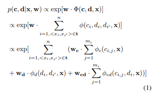
   1. content feature:  
       使用了包含 TF-IDF 在内的很多的人工经验信息，作为 $w_c$ 特征的指定。
   2. discourse features:  
       一样的人工经验信息 $w_d$ 
   3. Joint Features:  
4. next step
   1. 出发点很好，但是使用手工指定的特征是一个可以改进的点

---
## 21. S2S Learning for Task-oriented Dialogue with Dialogue State Representation
1. motivation
   传统的 seq2sqe 没有建模外部信息，很难让 seq2seq 生成在 KB 中存储的数据，比如时间地点等等，但是可以通过使用 pipeline 的方法是生成。集合二者，作者提出了将对话状态隐式的建模在 seq2seq 内部，并且对 KB 的查询使用了特殊的 attention 技术保证了可微性质，允许端到端训练，不需要额外的手工标注。
2. proposed
   1. 首先使用 attention 计算对应的对话状态表示，对话状态标识是一个矩阵 $d \cdot m$ 其中 $m$ 是 KB 中 column (数据特征) 的数目 slot 个数，数目和 KB 中的 column 数目一致，含义是建模对话状态到 KB 的每一个 slot 上至的概率分布里。每一个列向量代表 slot 中的状态的概率分布，使用的是 encoder 计算的隐含结果得到的 attention 权重计算，每一个 slot 一个 attention 参数。得到对话状态矩阵 $U^{in}$
   2. 同样使用 attention 四线，利用 对话状态信息和 KB 中每一个 entry 的 embedding 计算相似度，将相似度作为权重，进行求和操作，得到一个查询信息矩阵。得到对话信息矩阵 $U^{KB}$
   3. 级联得到 $U^{CAT}=[U^{in},U^{CAT}]$,$U=\tanh(WU^{cat})$ 矩阵 $U$ 可以看作是对话状态和知识库信息的集合。
   4. 使用上述的信息 decode
3. details
   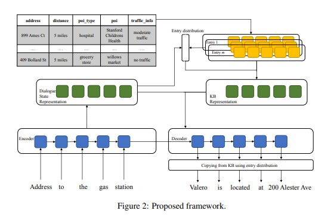
4. next step

---
## 22. Supervised and Unsupervised Transfer Learning for Question Answering
1. motivation
   迁移学习目前在语音识别方面已经获得了成功，但是在 QA 领域还没有过类似的实验。在本文中，作者从一个 source QA 中学习到的只是应用到 target QA(数据量很少) 中的迁移学习。作者目前只关注上下文信息敏感的多选 QA 。并对 QA 无监督迁移学习进行了分析。
2. proposed
   1. 监督迁移学习 source, target 都有对应的标注信息
   2. 无监督迁移学习 source 存在有标注信息，但是 target 没有标注信息。可以使用 `self-labeling` 方法
   3. 实验结果证明，简单的迁移技巧对于 上下文敏感的多选 QA 是有效的。并且对于无监督学习来说， `self-labeling` 的方法迭代是有效的。
3. details
   没有模型和方法的提升，只是提出了对特定的 QA 问题的迁移学习并发现对于监督和无监督环境下是可行的，没什么意思的一篇文章。
   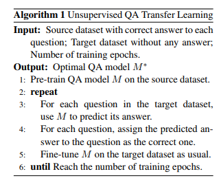
4. next step

---
## 23. Personalizing a Dialogue System with Transfer Reinforcement Learning
1. motivation
   训练一个个性化的任务导向对话系统是很困难的，主要好事在数据的收集方面非常的不足。在校的数据量上训练很容易过拟合并且难以适用到其他的用户上。解决这个问题的一个方法就是考虑大量的多用户任务导向对话系统作为一个 source domain 然而独立的用户作为 individual 作为 target domain 进行迁移学习。新的方法使用了个性化的 Q-function 显示的考虑了 source 和 targe domain 之间的差异。之前的一些工作聚焦在考虑用户之间的相似性实现个性化，但是没有考虑用户之间的差异会出现问题。
2. proposed
   1. 个性化的 Q-function:
       通用奖励 + 个性化奖励
   2. 迁移强化学习
       $$Q^{\pi_{u}}(H_i^u,A_i^u)=Q_g(H_i^u,A_i^u;w) + Q_p(H_i^u, A_i^u;p_u,w_p)$$
   3. Reward 设置
        * agent 提供信息获得通用奖励
        * 用户确认了 agent 的信息获得个性化奖励，否则惩罚
        * 用户付款，通用奖励
        * -0.05 的通用惩罚作为对轮数的控制，如果 agent 生成了没有逻辑的回复(重复问题) 惩罚    

    4. 使用SARSA 算法对 on-policy 过程学习(和 user-simulator对话)，
3. details
   4. 使用个性化可以根据用户不同的属性加快对话进程
   5. 使用 learn-based 而不是 rule-based 的算法对对话策略进行学习。
       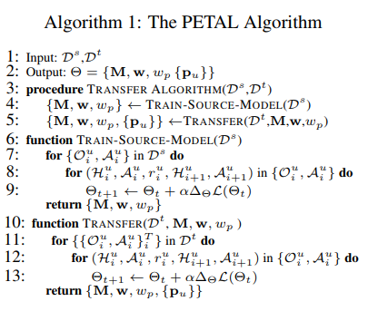
4. next step

---
## 24. Subgoal Discovery for Hierachical Dialogue Policy Learning
1. motivation
   目前的对话系统面对的都是简单的任务区完成，但是实际上面对更加复杂的问题，因为奖励稀疏(对话的轮数多引起的)和状态的搜索空间巨大导致非常困难，例如经典的traveling planning 任务中，包含有很多的子任务去完成，经典的解决复杂的问题的方法就是分治的思想，在这种方法下需要将问题分解成很多的子问题去解决。已经有很多的方法中，任务显示的手工标注了任务的层次性，但是在很多的情况下，任务的层次性是不明确的。作者提出了 SDN (subgoal discovery network) 的方法**自动学习建模这种分层的策略**,top-level 策略学习选择 subgoal ,low-level 策略学习选择一个固定的动作。实验结果显示效果比手工分层的效果还要明显。
2. proposed  
   HRL 算法通过折扣的**内部和外部奖励**进行优化，常用的是 DQN 算法
   1. 外部奖励: 对话成功 2L (L=60最大对话轮数) 奖励，失败 -L 奖励，每一轮有 -1 的惩罚
   2. 内部奖励: subgoal 的任务中，2L / K 是子任务成功过的奖励， - 2L / K 是子任务失败的惩罚，每一轮有 -1 的惩罚。  

    作者认为这样的设置可以保证 agent 尽可能的快的完成对话任务，并且在子任务之间的切换次数会比较少。

   1. 如下图所示，作者认为中间的红点是子任务的终结并划分的子任务。可以形式化的吧 subgoal discovery 的任务理解成是这样的路径分段任务
       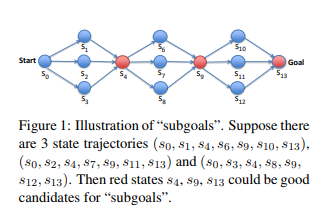
   2. SDN
       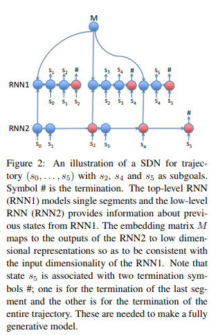  
         RNN2 的输出是一个 softmax 归一化的后的结果，其中概率分布的是 D 维的，作者认为 D 是要学习的 D 个子任务，使用小的 D 可以避免过拟合(超参数需要设置)。之后使用 M 对 D 的 softmax 进行 embedding 操作，去除对应的子任务的状态描述(这里要求 D 的概率分布尽可能的贴近 one-hot)。我在这里和作者认为的一致，作者认为 RNN2 是 sub-level, RNN1 是 top-level(遇到终止的开始新的 subgoal 的决策), 我认为刚好是反过来的，这有待讨论。作者将这个过程建模成这样的形式

        $$p(\sigma|s_0)=p((s_0,s_1,s_2)|s_0)\cdot p((s_2,s_3,s_4)|s_{0:2})\cdot p((s_4,s_5)|s_{0:4})$$
        但是我们对于子任务的划分是不知道的，这是一个问题($s_2,s_4,s_5$ 是不是子任务的划分我们不知道) 
        作者使用了这样的方法
        $$L(s)=\sum_{\sigma\in S(s),length(\sigma) \leq s}\Pi_{i=1}^{length(\sigma_i)}p(\sigma_i|\tau(\sigma_{1:i}))$$
        其中 $\sigma$ 是所有对 s 的可能的分段。然后使用 DP 去解 L(s)。优化目标是
        $$\min_{\theta}L = \frac{-1}{N}\sum_{i=1}^N\log L(s,\theta) + \frac{1}{2}\lambda ||\theta||^2$$

   3. 基于 SDN 的 HRL    
        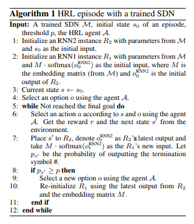

3. details  
   本篇论文是在下一篇论文的基础上做的工作，很幸运啊
4. next step
   分层是一个很好的想法，周志华曾经提起过这么一个观点，目前的 NN 或者说机器学习深度学习工作的很好的方法主要有下面几点
   1. 层次化
   2. 特征的内部变化
   3. 足够大的模型复杂度

---
## 25. Composite Task-Completion Dialogue Policy Learning via Hierachical Deep Reinforcement Learning
1. motivation
   这一片论文是上一个笔记的论文的基础，也是使用 HRL 学习对话策略。问题就不多赘述了。

2. proposed  
   1. 组件: 1. top-level policy select subtask 2. low-level policy select the 基本动作，所有的子任务是共享动作空间的 3. 全局状态跟踪器记录是不是所有的子任务都满足。
   2. 困难是因为对话轮数的问题限制，RL 搜索的状态空间非常巨大并且会出现奖励稀疏的情况。普通的 RL 算法在子任务之间切换过于平凡，降低了用户的体验
   3. 为了应对奖励稀疏的困难，作者采用了内部奖励的方法，通过内部激励展示子任务的完成的情况，当子任务完成的时候接受内部奖励由内部的 DM 提供这个奖励信息，可以帮助 agent 聚焦于完成当前的子任务，不要频繁的切换。
   4. 对话系统的组成部分: 1. LSTM NLU 2. state tracker 3. Policy 4. NLG
   5. HRL 分层学习过程  
        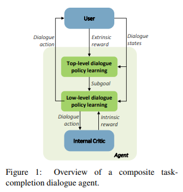

        内部奖励最大化和外部奖励最大化可以通过 DQN 实现，子任务没进行一步的时候会同时收到内部奖励和外部奖励

        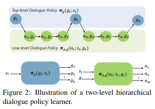

3. details
   1. 分层结构还可以提升对话流的一致性
   2. 不能处理多阶段，只能处理2阶段，**这一点可以继续往下做**

4. next step

---

## 26. Sentiment Adaptive End-to-End Dialogue Systems

1. motivation

   传统的 end-to-end 框架之考虑了用户的语义输入和其他的用户信息，但是没有考虑用户的情感信息，之前的工作有考虑用户的情感信息，但是只是通过声学特征进行考虑的，本文通过引入多种模态(声学，文本)的用户情感信息，证明在任务导向对话中，可以用来提高对话的成功率。

2. proposed

   1. 将用户的奇怪能干信息作为额外的文本特征，比给你且在强化学习中作为一种奖励的机制。

   2. 本文的立即奖励中包含的是情感信息，而不是传统的使用任务的完成率，使用任务完成率的缺点就是强化学习的速度很慢。本文的情感探测是随意的(预训练的情感探测器)，不需要任何的人为输入。

   3. 多模态情感判别器

      * 声学情感识别使用开源工具
      * 对话情感识别
        * 用户打断
        * 用户对 ASR 的识别信息不满意的时候会选择按下 button 提示
        * 对话系统重复询问同样的问题
        * 用户可以选择在对话过程中重新开始对话，这往往包含这负面的情绪
      * 文本特征: tf-idf

      使用随机森林作为情感分类器，结果显示添加了对话情感识别的效果会i有比较好的提升，最好的结果是上面的三种情况全部考虑下的。

   4. 监督学习

      1. **作者将监督训练任务转换成对对话动作的策略选择的问题，即给定对话的上下文在系统动作模板中选择一个动作去执行**，这里使用了 HCN ，之后会介绍。

   5. RL

      1. 任务导向对话的强化学习算法的传统问题就是，奖励信息(任务成功率)是延迟的，学习速度慢
      2. 在本文中，情感信息作为立即奖励，可以加快强化学习的学习进程，为此提供了一些新的 reward 的设计的方法，情感识别使用的是预训练的情感识别器。

3. details

4. next step

   1. 文章是使用了 seq2seq + RL 的形式，这样的工作模式可以用来学习如何 coding 类似的代码
   2. end-to-end task-oriented 框架目前对我的参考意义比较大。
   3. 数据集的设置可以学习一下
   4. 用户模拟器上做了大文章

---

## 27. Towards End-to-End Reinforcement Learning og Dialogue Agents for Information Access

1. motivation

   传统的符号查询 KB 系统的方式破坏了系统的可微分的性质，组织了 end-to-end 的训练，本文目的提出 soft KB query 可以保证 end-to-end 的训练。

   1. 传统的 KB 查询过程中不可能设计到语义分割的不确定性
   2. 传统的查询操作是不可微分的

   在本文中，作者提出了使用后验概率分布的形式计算用户对 KB 中实体的查询的相关性，是一种 soft KB 查询。

2. proposed

   一个外部知识库 KB 中存储的格式是 $(h,r,t)$ 其中，$r$ 是对 $h,t$ 的关系的描述，用户会在对话过程中给出一个实体的特征描述，对话系统返回对应的实体。后验概率分布的描述如下

   用户在第  $t$ 轮对话过程中对 KB 中的实体 $i$ 的确信度是 $p^t(i)$
   $$
   p^t(i) = \Pi_{j=1}^M\Pr(G_j=i)
   $$
   上述公式的含义就是agent 对用户对没一个实体的确信度是用每一个 slot 上的确信度的累积计算的。

   这个累积的计算主要包含两个元素

   1. 如果用不不知道第 $j$ 个 slot 的值是什么的时候，概率是 $\frac{1}{N}$, $N$ 是 KB 中实体的个数

   2. 如果用户知道的情况下，用户知道的 slot 的值不再 KB 中，也是 $\frac{1}{N}$，如果在 KB 中，概率是 $\frac{p_j^t(i)}{N_j(v)}(1-\frac{|M_j|}{N})$

      其中， $p_j^t(i)$ 的含义是用户在第 $t$ 轮对第 $j$ 个 slot 的之是 $v$ 的确信度概率，使用 NBT 计算出来，$N_j(v)$ 是 KB 中第 $j$ slot 的是值 $v$ 的实体数目，$N$ 是实体的总数，$M_j$ 是 KB 中第 $j$ slot 的的值未知的实体的数目。

3. details

4. next step

---

## 28. Hybrid Code Networks: practical and efficient end-to-end dialog control with supervised and reinforcement learning

1. motivation

   在对话系统中，使用 RNN 建模和i一个有趣的方向，但是需要大量的数据学习简单的行为i，本文引入了 HCN 将 RNN 和领域知识结合起来(领域只是被编码成了软件和系统的动作模板)的形式。HCN 可以减小对数据量的需求，并保留了隐含推断对话状态的能力。

   传统的任务导向对话是 pipeline 格式的，这样会引入复杂性

   1. 不清楚如何定义对话状态和保存那些历史信息
   2. 专门训练没一个组建是低效的

   最近端到端的方法去的了很大的推动作用，主要的优点就是段到段 RNN 架构可以推断状态的隐含表示，从而不需要对状态的标注的过程，但是端到端的架构很难引入领域知识和限制。为了解决这些问题引入了 HCN 除了学习 RNN 之外允许开发者通过软件或者动作模板的方式地定义领域知识。HCN 同时保持了 RNN 的可训练性和

2. proposed

   1. 核心组建: 1. RNN 2. 领域特殊的 software 3. 领域独立的模板 4. 传统的实体识别模块

   2. 正如下图所示是整个框架的流程。 

      输入用户的句子

      * bag of words
      * utterance embedding
      * entity extraction 比如识别 "lantian" 作为 <name>
        1. 简单的字符串模板匹配
      * entity tracking 模块由开发者提供，比如数据库接口等等，并返回 action mask 表示在下一个时间步允许的动作，作为一个 bit vector 。比如如果查询用户数据库发现对应的用户不存在电话号码的话，将打电话的动作遮蔽掉。有可以返回文本特征用来区别动作。
      * RNN dense net 计算对应的系统模板的概率分布。并使用 action mask 来显式的禁止某些动作。
      * 如果 RL 激活的话，选择动作，否则选择最大概率的动作。
      * entity output 模块，将对应的实体 action template 转换成对应的句子输出(fuy-formed action)
      * 输出的句子也可以作为特征继续输入。

   3. 使用 RNN 进行隐含的状态的推断

3. details

   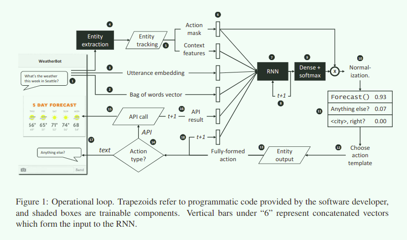

4. next step

---

## 29. BBQ-Networks: Efficient Exploration in Deep Reinforcement Learning for Task-Oriented Dialogue Systems

1. motivation

   更加有效的 RL 算法对 DQN agent，使用了 tompson 采样和 MC 的贝叶似网络，并验证了汤普森采样比 $\epsilon$-greedy 采样的优越性。当奖励稀疏的时候，典型的 DQN 并没不能很好的学习到策略，BBQ 可以鼓励 agent 对不确定性进行探索。

2. proposed

   对传统的 DQN 使用 汤普森采样和贝叶斯网络实现，可以发现这种方式对样本的利用性更高

3. details

4. next step

   1. 在 SeqGAN 类似的论文中，我们使用 seq2seq 进行对话过程的建模，但是实际上需要 pipeline 形式来替换这一部分 ? 
   2. 结合 SeqGAN  + D3Q + pipeline ? 有什么想法吗？

---

## 30. Adversarial Learning for Neural Dialogue Generation 

1. motivation

   传统的对话系统输出结果会出现 sentiment shift 和 sentiment full 的问题，传统的 MLE 的优化方案并不合适，使用对抗学习的思想是在对话方面的首次引入。引入在对话方面的对抗学习的主要目的直觉是，一个好的对话策略略应该是人类无法分别的。**这是一个无条件序列生成任务 GAN ，不是 conditional 的**

2. proposed

   在对话的对抗生成学习中，主要思想就是将序列生成的任务转化成了动作选择任务(强化学习的方法)，其中策略是通过 seq2seq 模型的参数确定的。

   1. 生成模型是标准的 seq2seq

   2. 判别器是一个二分类器，他的主要目的是输出的输入的句子是人类生成的可能性大小，在本文中，使用的是分层的 LSTM encoder

   3. 策略梯度学习

      使用判别器的输出结果作为 reward 传递给 generator 进行调整，使用 REINFORCE 强化学习算法，但是在生成序列的过程中，判别器需要的是完整的序列，这时候使用 MC 就可以采样生成的序列，计算判别其的均值作为 reward

   4. 但是在 generator 学习的过程中容易出现的问题就是，可能知道要修正但是不知道怎么修正才是最好的，所以作者应用的一个方法就是 teach forcing 使用 MLE 的方式训练生成器，指导向着好的方向发展

3. details

   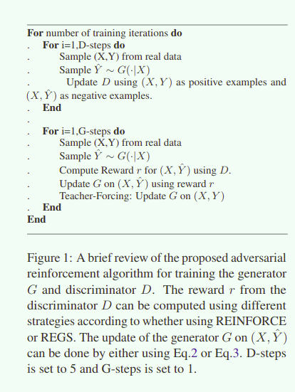

4. next step

---

## 32. Adversarial Learning of Task-Oriented Neural Dialogue Models

1. motivation

   传统的使用用户反馈和用户打分的任务导向对话的强化学习方法，很容易出现不一致的问题，并且在线的使用 RL 进行训练需要大量的和用户的训练数据。使用对抗训练的思路可以解决这个问题。并且，我们对使用对抗学习的过程中容易出现的漂移问题提供了一种解决方案。

   任务导向对话通常要涉及到多轮对话和外部知识库，这使得将对话系统哦你个和用户的交流并的十分重要。最近的任务导向对话都是使用的 data-driven 的解决方案，但是这些解决方案都需要最后获得用户的反馈(打分等等)。并且用户反馈可能存在不一致的情况，使用这样的 RL 算法也遇到采样率低的情况。

   这时候一个好的 reward 函数会起到很好的作用，但是手工制定这样的 reward 函数需要专家的建议，目前的有些方法已经考虑学习这样的 reward 技巧，但是还是会遇到不一致的问题和 RL 的样本利用率低的问题。

   为了解决这种问题，本文提出来任务导向对话的对抗学习策略，通过联合训练两个模型，生成器和环境交互(user simulator)完成任务导向对话，判别器标注一个对话样本是否是成功的。通过将对话 agent 的优化问题看作是强化学习问题，判别器的输出看作是 reward 推动 agent 向着人类完成对话的方式那样去学习。本文的实验效果展示了使用了对抗学习的效果好于手工制定的 reward function 展现了对抗学习的强大并解释对抗学习中出现的问题和相应的解决方案。

   最近的一些研究工作已经试图利用对抗损失作为额外的训练 reward ，但是本文将对抗损失作为唯一的强化学习的方法的 reward

2. proposed

   问题可以建模成序列决策问题，一个 agent 在基于对话上下文和用户的 goal 的预测的前提下生成最好的对话动作。

   $U_k$ 是用户的 $k$ 轮对话，$A_k$ 是用户的当前输出对话动作。

   判别器输出的结果是对话成功结束的概率。

   1. 生成器

      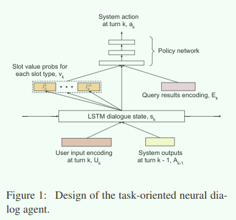

      1. 使用 LSTM 建模对话对话

      2. agent 在当前的对话动作的前提下 $s_k$ 选择最好的动作
         $$
         s_k=LSTM_G(s_{k-1},[U_,A_{k-1}])
         $$

   2. 信念跟踪器

      信念跟踪器通过累计置信度维护了用户的 goal ，用户的 goal 使用一系列的 slot-value 对的形式展现。每一个 slot 都有一个对应的 MLP 计算当前的对话状态 $s_k$ 的前提下的 goal 的 slot 的值 value 的概率分布。
      $$
      P(l_k^m|U_{\leq k},A_{\leq k})=SlotDist_m(s_k)
      $$

   3. 对话策略

      MLP 针对所有的系统预定以的动作。
      $$
      P(a_k|U_{\leq k},A_{\leq k},E_{\leq k})=PolicyNet(s_k,v_k,E_k)
      $$

   4. 判别器

      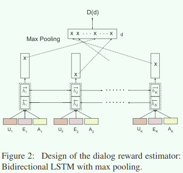

      * LSTM-last: 双向的 last $h_1,h_k$ 级联起来
      * LSTM-max: max pooling，**效果最好**
      * LSTM-avg
      * LSTM-attn: 简单的 attention 

   5. 对抗训练

      REINFORCE 算法进行策略梯度的策略提升，$D(d)$ 是在对话结束的时候获得的
      $$
      J_k(\theta_G)=\mathbb{E}_{\theta_G}[\sum_{t=k}^K\gamma^{t-k}r_t - V(s_k)]
      $$
      只有 $K$ 的时候(最终的时候)的奖励是 $D(d)$ 其他的时候的奖励都是 0，$V$ 函数使用前馈神经网络建模　

3. details

   

   1. 比较的手工制定的 reward 是在对话的没一轮中对 slot-value 的评估
   2. 针对漂移问题: 好的回答可能看起来和真是的不一样，这样会阻止算法生成好的但是和训练数据不一样的对话，应对这样的办法是在和真实用户交互的 10% ~ 20% 的时间中，将收到好的用户反馈的对话数据加入到真是样本中。

4. next step

   1. 摆脱 user simulator 的束缚可以吗 ?

## 33. Adversarial Advantage Actor-Critic Model For Task-Completion Dialogue Policy Learning

1. motivation

   为了应对现实中任务导向对话系统的奖励稀疏的情况，作者提出了 Adversarial A2C 的方法，通过将判别器的 reward 输出作为额外的 critic 的引入到 A2C 的框架中，鼓励对话 agent 探索和专家的一样的 $(s,a)$ 对加强我们的强化学习的效果。

   强化学习系统的任务导向对话最大的挑战是奖励稀疏的情况。为了处理奖励洗漱的情况，最长使用的方法就是通过已有的 human-human 对话语料和手工定义的规则客服这个困难。另一个方法就是使用启发式的方法是，使用手工定义的 reward 作为内部奖励指导强化学习的探索过程．但是外部奖励一般都是稀疏的．现有的方法都是使用这样的方式解决这个问题．

   本文综合了上述的方法的优点，使用判别器的输出作为内部奖励鼓励 agent 然所更多的好的空间．这样的建模的假设是基于这样一个方法: 人类专家的动作都是很好的，使用 GAN 的计算框架可以保证学习到这样的好的策略，加速学习的过程．

2. proposed1

   1. 使用判别器的输出作为额外的 critic 输入，加入到启发式的内部奖励中指导 actor 探索和专家类似的动作

   2. 使用这样的内部奖励机制可以加速强化学习的学习过程．

   3. 传统的 A2C 算法在这里使用

   4. 对抗损失也作为额外的 critic 作为内部奖励加速强化学习过程，也是使用的 TD error 的形式
      $$
      \delta_{GAN}^{\pi_{\theta}}=r_{GAN}+\gamma V_{GAN}^{\pi_{\theta}}(s')-V_{GAN}^{\pi_{\theta}}(s)
      $$

   5. 算法框架

      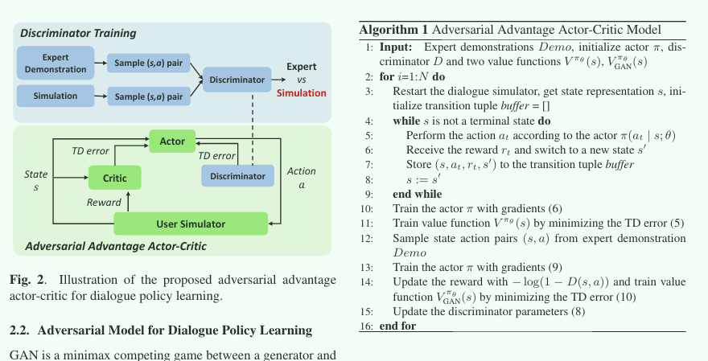

      注意这里的判别器使用的是 $(s,a)$ 作为输入，判断是否是符合的，并不是将整个 dialogue 作为输入

3. details

4. next step

   1. 只使用 $(s,a)$ 作为判别器的输入的好处是方便构建内部奖励，不需要使用 SeqGAN 中类似的 MC Search 的方法．这里是否可以更换更好的解决方案?
   2. 但是 $(s,a)$ 是否可以有效的体现出专家的效果，这是一个带解决的问题
   3. 还是使用了 user simulator 
   4. 作者认为可以应用到复杂强化学习任务中，层次化 RL ? 或者扩展到其他的 NLP / RL 任务中

## 34. End-to-End Learning of Task-Oriented Dialogs

1. motivation

   本篇文章是一篇指导意义很强的文章，这篇文章对 model-based RL 对任务导向对话学习和Adversarial 与任务导向对话学习进行了严格的分析.

   本文指出了pipeline的任务导向对话的一些缺陷,然后指出了 end-to-end 的训练方案,并取得了很好的效果,方法的总体思路是 **混合离线监督学习和在线交互学习** 两个主要的部分.通过先监督学习与训练之后,进行模仿学习和强化学习可以加强一些效果.并且为了解决之前的强化学习的采样效率的问题,引出了和 DDQ 思路一样的对话 model-based 强化学习.

   1. 传统的 pipeline 的对话系统的上游错误会传递到下游,并且组件单独训练.在本文中,通过将 pipeline 的组建构建成神经网络并使用可以微分的操作结合起来构成一个 end-to-end 的训练框架,缓解 pipeline 的这个问题.
   2. 首先进行混合离线监督训练,之后进行在线交互学习利用真实用户的反馈和示范进行模仿学习和强化学习,并使用 model-based 的方法对样本利用率加强.
   3. 本文相当与是对传统的任务导向对话的 NLU, DST, Dialog policy 部分的一个汇总

2. proposed

   1. 端到端的对话学习框架

      作者认为一个好的对话学习 agent 应该不仅仅接受环境的奖励信号作为反馈,同时还需要对环境进行建模并对环境的行为进行预测

      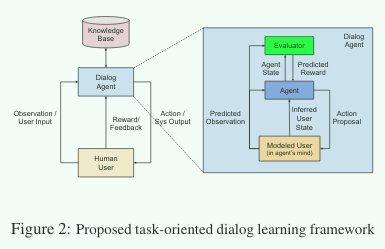

      正如上图所示,其中蓝色框内的就是 model-based 的 RL 中的世界模型 world model

      * dialog agent 不仅从现实环境中接受用户反馈的形式进行学习
      * 在 dialog agent 内部,还需要学习对真实的用户行为进行建模预测他们的行为继续对话

      对话架构如下

      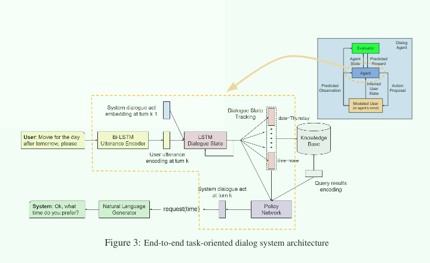

      使用分层的 LSTM 对多轮对话进行建模, low-level LSTM 对 utterance 建模,生成对应的 vector,high-level LSTM 对 dialog 进行建模,正如上图所示 BiLSTM utterance 是 low-level LSTM ,LSTM Dialogue State 是 high-level 的建模并维护记录了对话的状态.之后就是 dialogue state tracking 部分的内容,这部分通过利用对话状态,针对每一个预定义的 slot生成其中的 value 的概率分布,从而构成了 用户的 goal.整个架构是 end-to-end 的，可以整体训练．

   2. 从对话预料中学习 SL

      对话模型是分层的 LSTM 结构，最上层的 LSTM 输出的是对话的状态表示，并之后用来对每一个 slot 的 value 的概率分布进行预测，对于对话状态跟踪和系统 action 预测的损失函数定义如下
      $$
      \min_{\theta}\sum_{k=1}^K-[\sum_{m=1}^M \lambda_{l_m}\log P(l_k^{m*}|U_{\leq k},A_{\leq k},E_{\leq k};\theta)] + \lambda_a \log P(a_k^*|U_{\leq k},A_{\leq k},E_{\leq k};\theta)
      $$
      其中 $M$ 代表的是 $M$ 个预定以的 goal slot

   3. 从人类示范中学习 GAN

      监督学习可能没办法泛化到从来没有与见过的对话状态，这一点在和真实用户的交互中非常容易出现(小的错误都有可能会被放大)，这一节通过引入模范学习解决这个问题．

      通过让 agent 和真实的用户交互之后，在犯错误时让用户提出解决方案(纠错，解释正确的 action)，之后通过在这些和用户真实的数据上的 SL 学习可以解决这个问题．

      ---

      通常在 SL 的环境下，需要大量的数据集去解决上面提到的问题，解决这个问题的一个有效的方法就是使用 GAN ，使用 GAN 的目的在于恢复人类专家对于对话奖励的函数定义，让生成器表现的对话更像是人类专家的产生的那样(从而解决了容易产生错误的回答的情况)，判别器的结果额可以作为 reward 提供给生成器去进行调整．

   4. 从人类反馈中学习 Model-Based RL

      1. 人类的反馈只有在对话最后结束的时候被提供，并且每一小步都会加入一个 penalty 作为对家少对话轮数的惩罚．
      2. 使用策略梯度的方法进行学习

      ---

      1. 使用联合训练 dialog agent 和 user agent(goal 使用 LSTM 编码) 的方式加快双方的训练
      2. 使用和真实用户交互的方式是非常浪费采用资源的，使用 model-based RL 的方式可以有效的对建模 world model 提高样本的利用效果．

3. details

4. next steps

---

## 35. A Hierarchical Latent Variable Encoder-Decoder Model for Generating Dialogues

1. abstract

   序列数据中存在有潜在的层级结构，比如说对话中的那样，为了在生成模型中建模这样的层级关系，我们使用了可以跨越可变数量的时间步长的随机潜在变量。**VHRED** 实验结果显示我们的模型比目前的其他的对话生成模型更加优越。

2. introduction

   RNN 深度神经网络在很多问题设置中都发挥了非常巨大的效果，但是我们发现实际上 RNN 知识跟从了一个很浅层次的生成过程，这样的情况下模型的可变性和随机性都只发生在 word 采样的过程中。但是实际上的序列生成任务中，每一个子序列之间存在有相应的依赖关系，比如对话中的对话关系，但是如果随机性只发生在 word 层面上(子序列内部)的话很可能生成不一致和对话或者多层次的序列信息。如果一个模型只在单词级别注入可变性，它就必须在生成每个话语中的单词时逐步决定对话主题和说话人的目标。

   目前的商用的开放领域对话系统中使用都是简单的 seq2seq 模型，并没有涉及到层次化信息，在对话层级上的可变性和随机性变得非常低，很难生成有意义和多样性的对话。

   收到目前的这个问题的启发，我们提出了**分层隐变量 RNN** 架构，可以在对话过程中显式的建模多个层级的可变性和随机性。

   每一个对话设计一个高维的语义信息的向量，decode 的时候首先解码高维的语义信息高维的向量，之后 word by word 解码对应的 utterance。

3. Technical Background

   1. RNN Language Model
      $$
      P_{\theta}(w_1,...,w_M)=\Pi_{m=2}^MP_{\theta}(w_m|w_1,...,w_{m-1})P_{\theta}(w_1)
      $$
      上述的公式就是实际上 RNN 计算的语言模型的概率表示。最终的 word 解码过程可以使用是 softmax 信息。

   2. HRED

      HRED 是传统的 RNNLM 的扩展，该模型将 encoder-decoder 模型繁华到了对话场景下。
      $$
      P_{\theta}(w_1,...,w_N)=\Pi_{n=1}^NP_{\theta}(w_n|w_{<n})=\Pi_{n=1}^N\Pi_{m=1}^{M_n}P_{\theta}(w_{n,m}|w_{n,<m},w_{<n})
      $$
      其中 $w_n$ 代表是 $n'th$ 的对话。HRED 包含有 3 中子网络

      * encoder RNN: 编码每一个 utterance
      * context RNN: encoder RNN 的最后的输出作为输入送给 context RNN，建模对话内部的 utterance 的层级信息。
      * decoder RNN: context RNN 的隐含状态信息作为输入解码对应的 utterance

   3. The Restricted Shallow Generation Process

      无论是 RNNLM 还是 HRED 都存在有一个很严重的问题，挡在解码的中间过程的时候，子啊对话过程中，之后的每一次解码都需要确保保持对话的一致性，这是非常苦难的。作者将这个问题归结为 shallow generation process

4. VHRED

   

   VHRED 是对 HRED 的增强，这是通过在 utterance 层次上使用随机隐含变量的方法实现的。首先采样 latent variable 之后在 latent variable 的基础上输出结果的 utterance 。对每一个 utterance $n=1,...,N$ 存在有基于之前所有的观测到 token 的对应的 latent variable $z_n \in \mathbb{R}^{d_z}$
   $$
   P_{\theta}(z_n|w_{<n})=\mathcal{N}(\mu_{prior}(w_{<n}),\sum_{prior}(w_{<n})),\\
   P_{\theta}(w_n|z_n,w_{<n})=\Pi_{m=1}^{M_n}P_{\theta}(w_{n,m}|z_n,w_{<n},w_{n,<m})
   $$
   其中 $z_n$ 满足归一化的概率分布，遵从 $\mu$ 和协方差矩阵。

   * encoder RNN: 和 HRED 一样的结构，生成确定的 utterance 的向量

   * latent variable 部分的估计 loss

     latent表明我们说不清他们到底具体是什么，但可能是代表一种topic或者sentiment，是一种降维的表示。
     $$
     \log P_{\theta}(w_1,...,w_N)\geq\sum_{n=1}^N-KL[Q_{\phi}(z_n|w_1,...,w_n)||P_{\theta}(z_n|w_{<n})] + \mathbb{E}_{Q_{\phi}\\
     (z_n|w_1,...,w_n)}[\log P_{\theta}(w_n|z_n,w_{<n})]
     $$
     上式就是对 latent variable 的优化，优化 $P(w_1,...,w_N)$ 是困难的，我们只需要优化下届就可以了，下届本质上也是一个 two-step 的过程，首先是优化计算 $z_n$ 的 KL 散度，之后是在此基础上对 LM 的优化。
     $$
     Q_{\phi}(z_n|w_1,...,w_n)=\mathcal{N}(\mu_{prior(w_1,...,w_n),\sum_{posterior}(w_1,...,w_n)})\approx P_{\phi}(z_n|w_1,...,w_N)
     $$

     本质上 Q 就是隐含变量的概率分布。这个概率分布使用一个简单的前馈网络计算。

   * decoder RNN

     生成的时候输入是 $z_n, h_n^{context},h_{n,m-1},w_{n,m}$。通过引入了 $z_n$ 可以让 decoder RNN 专注于解码当前的 utterance 内部的内容。

5. conclusion

   对于 VHRED 的 decoder 时存在有两个目标，一是生成下一个 token，二是占据控制真实输出路径的 embedding space 的一个位置，来影响之后 token 的生成，而由于梯度衰减的影响，模型会更聚焦第一个目标，response 的产生更容易限于 token level，尤其对于 high-entropy 的句子，模型更偏好短期预测而不是长期预测，所以模型很难产生长的、高质量的回复。VHRED 针对这个问题引入了全局（语义层面）的随机因素，一是能增强模型的 robustness，二是能捕捉 high level concepts。Latent variable 使得 response 不再和一个几个固定的句子绑定，鼓励了回复的多样性。

   和 HRED 不同的是，VHRED 在第二个 context RNN 产生 context vector c 后，由 c sample 了一些高斯随机变量 z（latent variable），期望值和标准差由 c 决定（前向网络+矩阵乘法得到了噪声的 $\mu$，矩阵乘法和 softplus 得到 $\sum$），高斯变量和 context vector 拼接就得到了包含全局噪声的 vector，作为每个时间的观测值，和 query vector 一起放到 decoder 里产生 response。

   使用 VHRED 的主要目的在于可以生成更加多样性的回复等情况。对我目前的 idea 的指导意义并不大。

## 36. ITERATIVE POLICY LEARNING IN END-TO-END TRAINABLE TASK-ORIENTED NEURAL DIALOG MODELS

1. abstract

   任务导向对话中对对话策略进行训练的学习的最常见方法就是使用 user simulator 和对话 agent 进行人物导向对话从而提高对话的策略。但是一个好的 user simulator 是最后的 agent 的性能的瓶颈。构建一个好的 user simulator 和训练一个好的 agent 是一样困难的任务。为了解决这个问题，我们通过迭代优化 agent 和 user simulator 的方式实现对对话 agent 的持续性能提升。因为 agent 和 user simulator 都是 end-to-end 训练非常灵活，实验效果超过了 baseline.

2. introduction

   任务导向对话之前的主要方法就是使用 pipeline 的解决方式，但是这样的解决方式中的每一个组件都是单独的定义并优化的这让 data-driven 的方式没有办法应用在其中。目前新起 的方法是使用 end-to-end 的方法利用 data-driven 的方法解决这个问题，并使用 RL 的方法对对话策略进行学习，但是 RL 的方法需要对环境进行大量的采样，这让 user simulator 成了不得不考虑的一个方法去对 RL 进行训练。但是 user simulator 的好坏直接影响到训练的 agent 的效果。因此作者提出了联合训练 user simulator 和 agent 的迭代 RL 方法。作者将任务看作是一个 goal fulfill 的任务去实现。

   * 提出了 iterative dialog policy learning method that jointly optimizes the dialog agent and the user simulator
   * 设计了新颖的神经网络基础的 user simulator 可以通过 data-driven 的方式端到端的训练不需要额外的复杂的规则。

3. related work

   新的方法采用混合学习的方式，首先是  SL 之后是 RL 。之前迭代训练的方法已经提出来了，这里是将方法应用在 task-oriented 的任务环境中。

4. proposed framework

   首先使用语料库进行 SL 的预训练，之后采用 RL 的方法迭代训练，agent 评估 user simulator 的 goal 并尽可能的满足以保证高的任务完成率。

   * Dialog agent

     

     * $o_{K-1}^A$ 之前的 agent 的对话输出的 encoding
     * $o_{k-1}^U$ 之前的 user simlulator 的对话输出 encoding
     * $o_k^{KB}$ 外部知识库的信息 encoding
     * $s_{k-1}^A$ agent 的上一个对话状态，更新后得到 $s_k^A$
     * $a_k^A$ 系统动作
     * $l_{n,k}^A$ 系统信念状态槽估计
     * $e_k^A$ 指向检索信息的指针
     * $u_k^A$ 第 $k$ 轮的 agent 的对话输出

     1. utterance encoding 使用标准的 BiLSTM $o_k=[\overrightarrow{h_{T_k}^{U_k}},\overrightarrow{h_1^{U_k}}]$

     2. action modeling 使用多分类的方法，在当前的状态 $s_k^A$ 的基础上
        $$
        s_k^A=LSTM_A(s_{k-1}^A,[o_{k-1}^A,o_{k-1}^U,o_k^{KB}])\\
        P(a_k^A|o_{<k}^A,o_{<k}^U,o_{\leq k}^{KB})=ActDist_A(s_k^A)
        $$
        其中 ActDist 是 MLP 使用了 softmax 输出可能的动作的概率分布。

     3. belief tracking

        使用一系列的 slot-value 代表用户的 goal 
        $$
        P(l_{m,k}^A|o_{<k}^A,o_{<k}^U,o_{\leq k}^{KB})=SlotDist_{A,m}(s_k^A)
        $$
        SlotDist 也是 MLP 使用了 softmax 的方法输出对应的每一个 slot 的值的概率分布。

     4. KB operation

     5. Response generation

        使用模板的方法实现

   * User simulator

     

     1. 对于每一个用户给定一个 random goal $g_k^U$ 由 list of slot 组成，用户 goal 在对话过程中保持不变。
     2. 用户的输出 encoding $o_{k-1}^U$
     3. agent 的输入 $o_k^A$动作选择的方式和 agent 一样

   * Deep RL Policy Optimization

     RL 的策略优化建立在 SL 的预训练的基础上

     

     1. State: $s_k^U,s_k^A$ 其中 $s_k^U​$ 也编码了用户的 goal

     2. Action: $a_k^U,a_K^A$ 

     3. Reward: 通过对对话完成率的计算获得，每一轮都会收获 $r_k$ 这是通过基于目前的对话过程得到的。$score_k$ 在对话结束的时候返回用来表示对用户的 goal 的完成情况。
        $$
        score_k=\mathcal{D}(g_k^U,g_k^A)\\
        r_k=score_k-score_{k-1}
        $$
        $g_k^U,g_k^A$ 是用户的 goal 和对用户的 goal 的估计，对话结束的时候 $s_k$ 可以通过对话成功率等等情况获得。

     4. Policy Gradient RL

        REINFORCE 算法可以使用

        对于 agent 参数的 $\theta_a$
        $$
        \nabla_{\theta_a}J_k(\theta_a,\theta_u)=\mathbb{E}_{\theta_a,\theta_u}[\nabla_{\theta_a}\log \pi_{\theta_a}(a_k^a|s_k^a)R_k]
        $$
        对于 user simulator 参数的 $\theta_u$
        $$
        \nabla_{\theta_u}J_k(\theta_a,\theta_u)=\mathbb{E}_{\theta_a,\theta_u}[\nabla_{\theta_u}\log \pi_{\theta_u}(a_k^u|s_k^u)R_k]
        $$
        作者使用了 A2C 作为对 REINFORCE 的优化

5. conclusion

   我的 idea 被做了，😭

