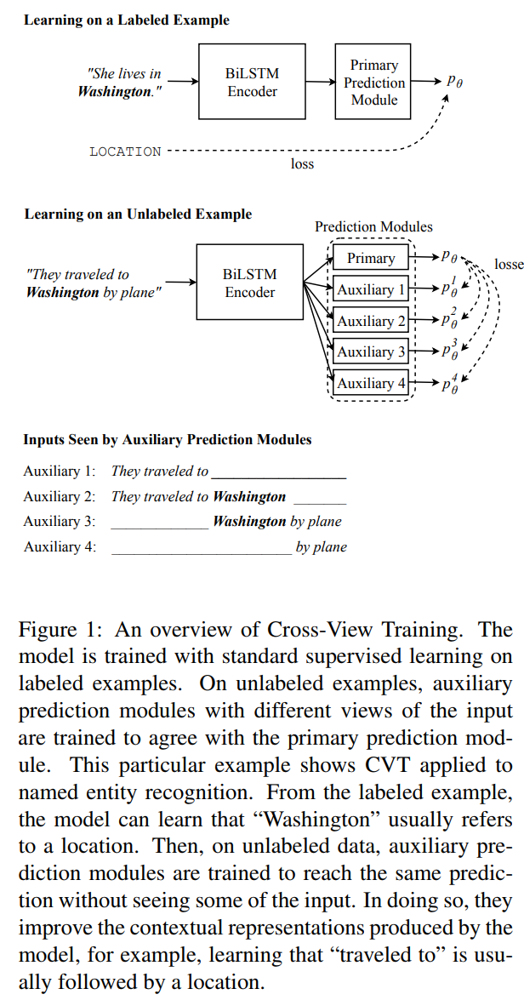
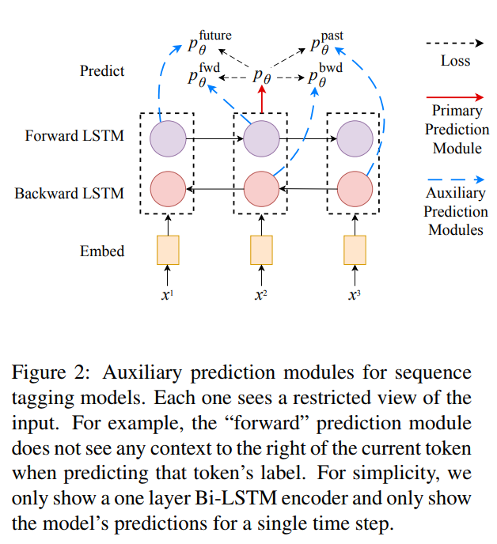

## Semi-Supervised Sequence Modeling with Cross-View Training

### Abstract

无监督的方法例如 word2vec 或者 ELMo 等利用词的分布表示(共现性质)学习词的低维嵌入。监督方法使用标注信息提升模型的预测效果。本文提出了半监督的方法提升了 Bi-LSTM encoder 的表示学习效果，其中的监督数据使用方式一如既往，但是无监督的部分数据中，模型试图让一个辅助的预测模块(比如观察部分的数据 utterence)去预测整个模型的表示，因为两个子模块都是共享中间权重的，这样的方法可以从侧唛你提升模型的效果，并且结合多任务学习的时候效果更好。

### Introduction

1. 监督数据是难以获得的，最近的半监督的任务试图通过在大规模无标注语料上进行预训练然后针对特定的任务进行 fine-tuning 但是缺点是预训练是通用的不针对具体的任务，效果不好。
2. 但是传统的半监督方法，比如 self-training 不会遇到这种问题，因为 self-training 使用了混合的标注和无标注数据进行训练。但是这样的方法不适用于神经网络的模型。
   * 标注数据训练方式一致
   * 在无标注数据上，模型根据 example 预测结果，并又试图利用这些预测的结果进行训练
   * 这种方法某种程度上是不稳定的,CV方面最近通过在训练的时候对input引入噪声的方式解决robust的问题
   * 但是引入噪声的方法对于离散的 NLP 任务来说是困难的
3. 本文的方法是一种 self-training 的新方法，但是适用于神经网络。
4. 作为解决方案，本文使用 multi-view 的方法，通过不同的角度对待 input 并 force 产生一致的预测结果，这种方法不是将 full model (auxiliary model，full model 是文中的两个不同的 model 可以在 self-traing 的角度下把 full model 看作是 teacher, auxiliary model 是 student) 看作是一个等待训练的模型，通过引入辅助预测模块(一个简单的神经网络，将向量表示转换为预测) 来完善 full model，其中辅助模型使用的是受限制的(部分的)输入数据，比如说在 Bi-LSTM 中，受限制的输入就是单向的 model 忽略了另一个方向的信息。
5. 辅助模型通过让预测和 full model 一致的方式提高对 sequence 的表示学习的效果，因为是 辅助模型和 full model 之间是共享权重，所以反而提高了表示学习的效果。
6. 文中认为 CVT 是可以适用于多种任务的，但是本文只关注 sequence modeling 并且 CVT 方法适合于 muli-task

### Cross-View Training

正如上图所示，full model 使用监督训练
$$
L_{sup}(\theta)=\frac{1}{|D_l|}\sum_{x_i,y_i\in D_l}CE(y_i,p_{\theta}(y|x_i))
$$
之后指定 $k$ 个辅助模块针对 full model 的预测结果进行逼近
$$
L_{CVT}(\theta)=\frac{1}{|D_{ul}|}\sum_{x_i\in D_{ul}}\sum_{j=1}^k KL(p_{\theta}(y|x_i),p_{\theta}^j(y|x_i))
$$
其中使用 KL 散度对两个分布进行逼近的优化。

**比如上图所示，辅助模型只使用 Bi-LSTM 中的一个 LSTM 的参数来进行预测，进而通过辅助模型优化 full model 的表征学习的效果**

总的 loss $L=L_{sup} + L_{CVT}$ 因为每一个辅助模型只是用了简单的单层网络，所以计算复杂度提升不高

---

CVT 可以简单的结合 multi-task 学习任务并提升效果，并且速度整体上有所提升。

### Cross-View Training Models

1. 使用 2 层 CNN-BiLSTM 进行 encode 

2. CVT for Sequence Tagging

   

   如上图所示，使用四个 NN 利用受限制的信息进行预测，蓝线是辅助预测模块，红线是 full model 

3. CVT for Dependency Parsing

   使用 graph-based 的依存分析，使用分类的方法预测当前对应单词的依存结果。

4. CVT for Seq2Seq Learning

   1. 使用 seq2seq with attention 进行分析，LSTM encoder + LSTM decoder + bilinear attention

   2. 应用两个辅助的 decoder 实现 CVT ，辅助的 decoder 和 full model 的 decoder 共享权重和 embedding

      但是使用了不同的 softmax 对词进行分类

   3. 一个辅助 decoder 使用 attention dropout 随机失活一些 attention 权重，另一个辅助 decoder 试图预测下一个 target word 而不是 current word 

### Conclusion

1. state-of-the-art
2. multi-task better

