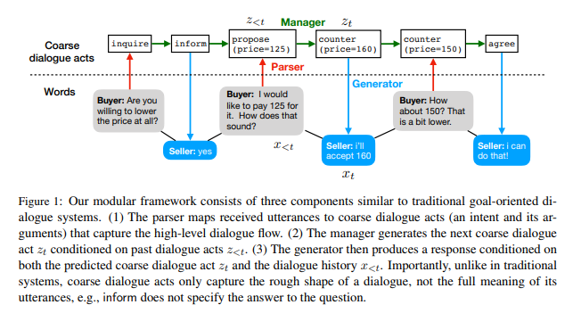
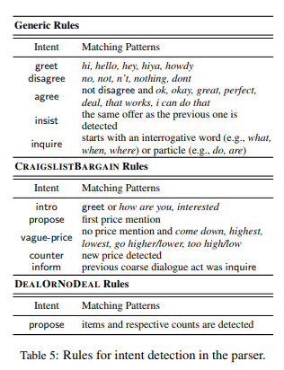
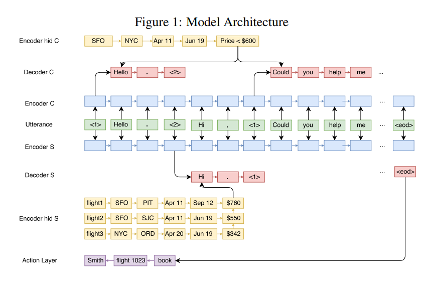
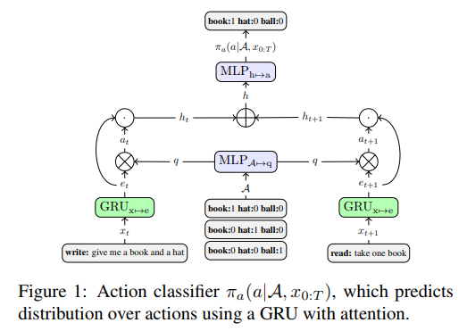
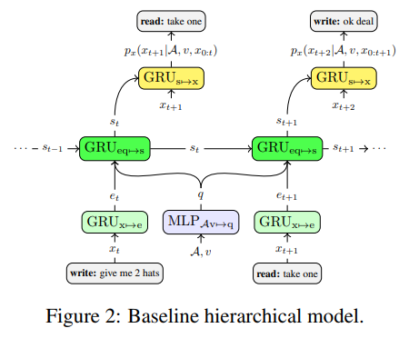
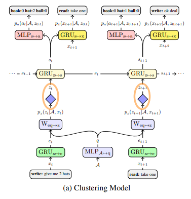
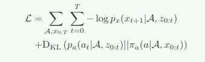
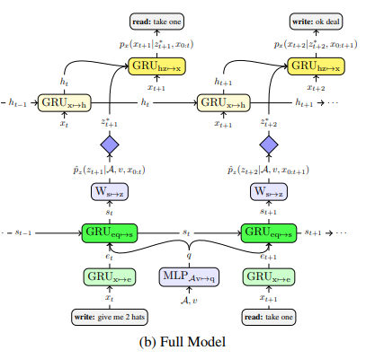

# List paper conclusion about **Deal or no Deal**

>一个新的 idea 这些论文好像都没有对对方 agent 的建模，也就是说 model-based 的含量不足，当然 model-based 是引入的一种方式，如何在对话过程中对对手进行建模也是一个很好的切入点，通过对对手的建模更有效的学习．我目前的思路是在对话后(或者对话过程中，过程中的话，使用带有噪声的 KL 散度优化？前面的噪声大，后面的噪声小？)进行对对方的 goal 的预测．再想想 ......

---

## 1. Decoupling Strategy and Generation in Negotiation Dialogues

1. abstract

   本文是在 deal or no deal 的论文的基础上进行开展的工作，作者认为传统的 deal or no deal 的方法使用的是 end-to-end 的策略没有办法对策略进行控制并且在此基础上的强化学习似乎会造成效果退化的问题。因此在本文作者提出了模块化的方法，支持 SL, RL , domian-knowledege 等等方法的引入，作者的实验是使用的检索式的生成结果，并在 deal or no deal 的基础上进行了实验，并扩展提出了新的数据集。实验效果显示新的方法的效果更好。

2. introduction

   1. 传统的 goal-oriented 方法经常倾向于策略而不是 NLG

   2. 最近的 deal or no deal 的方法使用 seq2seq 克服了这个问题，但是因为模型是 end-to-end 的没有办法对策略进行控制，并且使用 RL 直接对最后的奖励(减少对话轮数，成功率越高越好)进行学习的话，很容易出现效果退化的问题，这里的退化体现在 NLG 的效果变差以及重复一句话。

   3. 作者提出的方法是对策略和生成两个部分进行 **解耦**，从而对策略有更好的控制效果。

   4. 提出的模型

      

      1. 简易的关键字解析器和实体识别生成粗糙的 dialogue act 收集高级对话策略，不能捕获全局的 utterance 的信息
      2. 对话管理器选择合适的响应
      3. 生成对话

   5. 提出了新的信息更加丰富，更具真实实践场景的数据集，并关注两个重要的指标(**对话的评分，人类相似度(GAN can be used ?)**)并且最终的粗糙的 dialogue act 管理器是可以解释的。

3. approach

   1. motivation 就是传统的 goal-oriented 的对话中，对话策略和对话的生成分开学习，进行解耦。

   2. overview

      * 根据对话历史 $x_1, ...,x_{t-1}$ 和对话情景 $c$ (物品的描述)生成当前的对话响应 $x_t$

      * 粗糙的 dialogue act (说话人的意图) 解析器针对 $x_t$ 解析出对应的意图 $z_t$ ，这里的意图识别并不需要完整的语义信息

        * `parser`: 提供 $x_{<t},z_{<t},c$ 映射 $x_{t-1}$ 到 $z_{t-1}$

          简易的 rule-based 的解析器，匹配实体和关键字

          

        * `manager`: 在 $z_{<t},c$ 基础上预测 dialogue act $z_t$

          `dialogue manager` 是要学习的对象，这里可以采用 SL, RL, inject hand-coded rule

          1. SL

             最大化 $p_{\theta}(z_t|z_{<t},c)$ 根据训练数据，使用标准的 seq2seq with attention，dialogue act 表示成一个小的序列比如 `offer 150` 

          2. RL

             在对话 dialogue act 的序列上定义奖励函数 $R(z_{1:T})$ 比如length of turns。使用 REINFORCE 策略梯度算法进行优化。

          3. hand-coded rule

        * `generator`: 根据 $x_{<t},z_{<t}$ 生成对应的自然语言表示 $x_t$    

          使用检索的对话生成，数据库中每一个检索的条目是 $(d(x_{t-1}),z_{t-1},d(x_t),z_t)$ 其中 $d$ 是模板抽取器，根据 $z_t, z_{t-1}$ 检索出对应的候选条目，之后根据对话上下文等继续排序。

---

## 2. AirDialogue: An Environment for Goal-Oriented Dialogue Research

1. Abstract

   这是一篇引出未来的一些新的 idea 的文章，文章提出了一个新的数据集，并在上面进行测试发现现有的一些方法并没有取得很好的效果，和实际的人类的水平相比存在有较大的差异，**主要目的在于简化对话的评测**。

2. Introduction

   新的数据集上的实验结果显示，即使是最好的对话生成模型也只能产生 0.33 的成功率，但是人类标准是 0.94 ，然后引出这是一个比较有潜力的领域。

   每一个对话的 agent 被提供了 $c=(c_c,c_a)$ 其中的 $c_c,c_a$ 代表的是每一个agent 的 context 描述。$c_c= (tr, o)$ 其中的 $o$ 是 goal，$tr$ 是限制。$c_a=(db,r)$ 表示数据库和用户是否已经存在预定。 

3. approch

   nothing to say, and dataset can not be accessed !

---

## 3. A GOAL-ORIENTED NEURAL CONVERSATION MODEL BY SELF-PLAY

1. Abstract

   使用 MLE 进行训练并不会让模型朝着完成 goal 的方向去优化，目前的 RL 的方法也会容易造成语言模型的性能降低。论文提出在两个代理之间对单个模型执行模型级别信息隔离

2. introduction

   end-to-end 的方法在 chitchat 领域的成功不能有效的迁移到 goal-oriented 的任务导向对话领域中。

   ```
    We define the goal oriented conversation problem to be a dialogue cooperation with two agents each having access to some pieces of hidden information that is only visible to itself
   ```

3. approches

   1. 在订机票的人物下，存在有两个 agent (custom agent, server agent ) 双否都有自己的 goal 和限制。server agent 的目的是引导 customer agent 完成对话。

   2. 对话的有效性可以通过最终执行的动作是否是满足限制条件的进行判断。

   3. 模型除了 word embedding 矩阵之外，其他的所有参数都是独立的。模型的基本组成部分都是一致的，处理对隐含的知识的 encoder 和 action decoder 不同以外

      

   4. 使用 SL 对两个 agent 进行训练 $U,R,K,A$ 分别表示 utterance, restriction, database, action

      1. 对外部知识进行编码的时候，使用的方法对于 customer agent 就是简单的 GRU 处理，用最后的隐含向量作为特征表示 $h_R$

         对于 database $K$ 的编码使用的是分层的 GRU 得到 $h_K$ 

      2. dialogue encoder and decoder

         如上图所示 <1> 表示turn start,<2> 表示 turn end, <eod> 表示对话结束，使用的 multi-GRU 作为 customer 和 server agent 的编码器，agent 都有自己的解码器，解码器的输入是 $[h_T^c,h_R]\ or\ [h_T^s, h_K]$

      3. action state decoder

         正如上图所示，在对话结束的时候，service agent 解码输出对应的动作序列 “name, flight recommendation, action states”也是简单的 seq2seq 架构。

      4. optimization

         监督学习考虑的是 dialogue and action states 的两个损失

   5. self-play 训练

      只提供 $R, K$ 使用 SL 的训练权重作为初始化，一个 agent 的参数冻结，一个 agent 的参数更新(策略梯度等算法)

      1. 生成的对话是从策略中采样出来的不是传统的使用 softmax 生成的最好的 token 。

      2. value networks
         $$
         v(u_{1:t}^{'c})=z^c \cdot h_R\\
         v(u_{1:t}^{'s})=z^s\cdot h_K
         $$
         上述的 $z$ 是使用 GRU 对上下文处理得到的，使用 value-based 的强化学习算法可以进行优化

      3. policy netoworks

         使用 REINFORCE 算法进行强化训练。

4. experiment

   实验的数据是 planning 生成的，笑哭😂！他们认为 deal or no deal 这篇论文和他们的论文的差别在于他们的 agent 的参数是共享的，而他们的论文的卖点是 agent 的参数是不共享的。并且他们将对话数据与行动状态紧密联系在一起。

   ```
   In this paper, we propose a new setting in goal-oriented dialogue system to tighten the gap between these two aspects by enforcing model level information isolation on individual models between two agents
   ```

---

## 4. Hierarchical Text Generation and Planning for Strategic Dialogue

**之前的几篇主要 idea 在于将 goal-oriented 的任务的策略和语言模型部分分开进行训练从而实现更好的训练效果。这篇文章也是。**

1. abstract

   本文提出的方法将语义信息从语言模型抽取出来，实现了对策略和语言模型的解耦。实验结果显示随着 RL 对对话的goal 的提升，语言模型没有漂移。新提出的模型在语言模型和策略上都有着很好的效果。

2. introduction

   分层表示的 $z_t$ 试图去学习最终要输出的句子 $x_t$ 的隐含信息而不是这个句子本身。

   之前的一些工作显示使用 RL 会对语言模型产生影响，本文的方法显示这样的影响对于本文提出的方法来说是不存在的或者说是有些微的缓解。

   论文实在 deal or no deal 的基础上开展的工作，任务的困难性在于策略和语言模型的共同训练。

   对于策略基础的文本生成任务很可能会遇见这样一些问题

   1. 缺失语义多样性: sampled 的结果都是相同的意图的
   2. 缺失语言多样性
   3. 缺失内部一致性: 输出的话语前后矛盾
   4. 缺失上下文一致性
   5. 策略参数和语言模型参数纠结在一起: 这是 end-to-end 的问题，没有分开 what to say and how to say 这也是 RL 可能会影响语言模型的主要原因。

   作者认为这些问题都是因为 work-by-word generation 而没有提前决定输出的 utterance 的意图。

3. models

   1. action classification

      预测对话结束的时候的最终动作 $\pi_a(a|A,x_{0:T})$ 使用 RNN with attention + MLP  实现

      

   2. baseline hierarchical model

      

      $v$ 是 action-value function

   3. Learning Latent Message Representations

      核心在于将 utterance $x_t$ 编码成对应的离散隐含变量表示 $z_t$ 学习文本的表示

      

      如上图所示，可以将上面的分层模型看作是 baseline 的一种变体，这里引入了 softmax 矩阵参数用来将原本的句子表示转化成对应的隐含信息表示。在解码的时候也会输出 $a$ 这里的 $a$ 动作表示当对话在这里停止的时候会如何输出结果。这里对于动作分类器进行的优化类似与建模对方的意图．这里训练的时候缩减 $MLP_{s\rightarrow a}$ 和预训练的 MLP 和之间的差别(减少 KL 散度)．

      

   4. 分层文本生成

      

   5. 分层强化学习的时候，冻结和语言模型有关的参数，只将对应的策略参数继续更新，这是一个**启示**


---

## 5. Prosocial or Selfish? Agents with different behaviors for Contract Negotiation using Reinforcement Learning

>相关性不大的一篇文章，重点找一下 idea 细节就不涉及了

multi agent 算法的论文，了解不甚多，不敢作出过多的总结．

---

## 6. EFFICIENT DIALOG POLICY LEARNING VIA POSITIVE MEMORY RETENTION

>积极记忆保留的高效对话策略学习，通过对策略梯度算法进行优化，解决传统的 RL 算法的对样本的利用率较低的问题，model-based 的方法也是这个出发点但是思路不同．提出了 on-off-policy policy gradient 算法解决 agent 和环境之间的交互频繁的样本利用率低的问题．一个纯 RL 算法，对 idea 的指导意义不大．

---

## 7. The Bottleneck Simulator: A Model-based Deep Reinforcement Learning Approach

>解决 RL 的采样利用率的问题，这次使用的就是 model-based 的方法，和 DDQ, D3Q 的思路如出一辙

1. 提出了 model-based RL 方法: bottleneck simulator
2. 提供了对算法的数据分析
3. 分析了 bottleneck simulator 的数据利用率