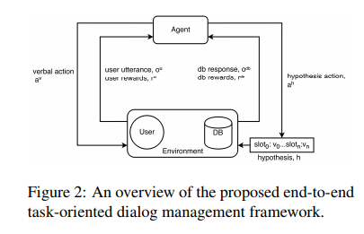
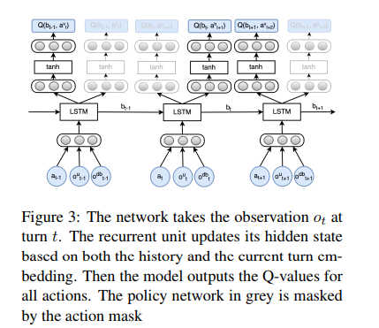
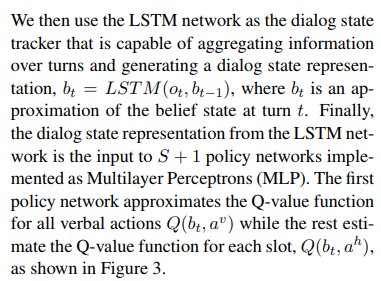
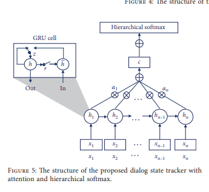

## Suvery: Dialogue Generation from Structed Knowledge

## A Knowledge-Ground Neural Conversation Model

1. 传统的对话系统虽然可以直接蒋真实世界的北京知识直接注入并生成对应的相应，但是需要大量的手工标注。神经网络模型虽然可以生成很类似人的对话，但是很难生成对应的外部知识数据。
2. 通过对 seq2seq 进行扩展，使用 multi-task 方法引入了对话和非对话数据，这样做的原因在于不仅仅使用了对话的上下文信息还使用了对话上下文相关的外部数据信息。
3. 
4. 使用世界事实的好处在于，如果使用的数据中出现了OOV 的话，根据 IR 检索系统可以依然有效的选出合适的有关 facts 进行进一步的对话生成。
5. 使用 multi-task 的方法进行学习
   * 针对 $S,R$ 的直接对话训练，$S$ 是对话历史，$R$ 是响应
   * 使用 $\{f_1,...,f_k,S\},R$ 的方式训练避免对话过程中出现的极具的信息转变。
6. 使用 GRU 构建 dialogue encoder 和 decoder 并且不共享权重，facts encoder 使用的是简单的 RNN 架构保持模型内部的兼容性
7. 不需要填槽过程

## Incorporating Relevant Knowledge in Context Modeling and Response Generation

1. 对一个对话系统来说，可以在对话的过程中意识到对话主题的对应的相关知识是非常必要的技能。

2. 在这项工作中，使用被广泛采用的 TransE 模型嵌入我们的KG (Bordes et al. 2013)，并以一种新颖的方式将知识嵌入到会话模型中。

3. 主要组件

   * 上下文知识收集器将用户输入进行实体识别和外部数据库关联，本质上就是收集对应的属性和实体(slot and value)
   * 在收集的属性和实体的注意力上应用 seq2seq 架构 encoder
   * entity-aware decoder

4. 

5. 实验时为了高效起见，并不是在大量的图上运作的，先抽取子图，在和对话内容相关的子图上抽取对应的外部知识。

6. 

   node 是 entity，edge 是 attribute 如果在用户的 input 中找到了对应 entity 很热 attribute 的话，可以在图谱中进行扩展。1-hop, 2-hop, multi-hop。

7. 之后提取出来的实体和关系都会被送入 encoder decoder 架构中进行 decode 生成回复

8. 正如上上张图显示的，使用了 attribute-aware 的 attention 策略，对输入中和 attribute 有关的那些 token 的权重比较大，从而保证 decoder 和 input 的逻辑是类似的。

9. entity-aware 的 decoder 策略中通过 pointer gate 指示什么时候使用外部抽取的 entity 进行输出。

10. 参考意义很大，我是不是要把重点放在如果知识图谱中存在有 item node, attribute node, value node 的话，根据 attribute node 的激活情况，执行不同的动作可以实现强化学习驱动这一点。

## Augumenting End-to-End Dialogue Systems with Commonsense Knowledge

1. 自称是首次将大规模常识信息引入端到端模型的方法并在检索的场景下考虑了对话上下文和相关的常识进行检索得到了很好的效果

2. 目前有尝试将尝试知识引入到对话系统中，但是在开放领域对话系统中需要一个高效的方法将常识信息居合道模型中。

3. 常识知识非常巨大我们不能依靠使用模型参数存储而要考虑外部知识库

4. 常识信息往往可以表示成知识图谱的形式，其中概念是 node 关系是 relations 

   

5. 本文将常识信息聚合到检索对话系统中，因为这样的系统比较好评估，而且需要很少的数据就可以驱动。

6. 为了便于快速的根据 node 信息检索对应的三元组，以 node 为 key 存储大量的三元组作为列表的元素，输入用户的检索 input 对话信息，根据简单的 n-gram 匹配抽取抽取对应的大量相关的三元组信息。

7. 

   利用 LSTM 将所有的有关的三元组信息编码，如上图红虚线内所示，并将排分最大的那一个作为核心的 a 作为关键的常识知识用来对 y 进行一个合理的评分。

## Knowledge graph inference for spoken dialog systems

1. 提出了推理知识图谱，一个新颖的将知识图谱映射到马尔可夫随机场的方法，创建对话系统的信念追踪器组件，将对话状态跟踪和外部数据查询整合成一个单独的步骤。

2. 知识图谱可以减少任务导向对话系统迁移到其他领域的人工工作量。

   

3. 迁移知识图谱到一个概率图模型作为对话状态跟踪组件是一个全新的工作，图模型对每一个 slot 维护一个概率分布

## Knowledge-Graph Driven Information State Approch to Dialog

1. 该论文和我的想法非常的契合，但是本论文的工程程度很重
2. 本论文将知识图谱和 ISU 信息状态更新方法结合对任务导向的对话系统进行了应用，并在 food domain 上进行了实验，构建了知识图谱驱动的对话管理架构
3.  A key property of an information state-based theory is that the dialog “information” is encoded in the state itself. 基于信息状态理论的一个关键属性是对话“信息”编码在状态本身中。现存的商业对话系统使用的是预定义的节点和之间的动作转移，人工参与的程度很高。ISU系统对话框状态集和可能的状态之间的转换不是直接手工生成的，而是从对话流在结构化数据表示上运行的一系列规则的应用中产生的，这些规则在交互的每个点捕获当前对话状态
4. ISU 系统通常定义为一系列的规则，由 pre post 条件组成，通过状态和 pre 条件的匹配，对话系统执行对应的规则。但是使用知识图谱基础的系统的话，需要特定的领域知识和基础。
5. 在 ISU 系统中，move 的含义是对话动作，比如 ask, answer 等，在知识图谱下，move 表示的含义是对信息状态的一种操作。并且动作的选择是使用打分函数决定的
6. 需要领域独立的 NLU 组件识别 intent 和 entity，NLG 是模板式的

## A knowledge Enhanced Generative Conversational Service Agent

1. 使用**搜索引擎**捕获外部知识，并在此之上使用 seq2seq 方法驱动构建多论文对话系统，实验在 DSTC6 上

2. 也是任务导向对话领域，作者认为虽然有人的研究方向是构建请求和相应的相关性，但是很少使用和对话历史相关的外部只是来进行相应生成。

3. The whole system consists of a knowledge extractor, a knowledge encoder, and a knowledge enhanced sequence-to-sequence model including a query encoder and a decoder for response generation

   

4. 

## Extending Neural Generative Conversational Model using External Knowledge Sources

1. 聚合 unstructable 信息到 seq2seq 架构中,chit-chat
2. memory network 可以做这件事，但是缺点是太慢和超参数搜索的困难无法处理大规模非结构话信息，使用外部知识可以更快速的获得知识信息有更快的训练速度
3. 

## Mem2Seq: Effectively Incorporating Knowledge Bases into End-to-End Task-Oriented Dialog Systems

1. **seq2seq 的对话状态是隐式的，但是缺少很明显的不可解释的信息没有办法，这对之后的 taskorientd 的相关操作比如查询数据库等造成了不稳定性,有点事不需要手工标注信息了，但是鉴于使用知识图谱的方式来显式的构建这个对话状态可以客服这一点，也不需要手工标注信息**
2. 尽管可以可以使用 memory 网络解决 RNN 的 OOV 问题，但是作者认为这样的 end-to-end 方法还是有以下的缺点
   * RNN 不稳定，聚合外部信息到 RNN 中困难
   * 长序列难处理
3. memory RNN 网络可以存储外部信息方柏霓查询，并且可以实现 multi-hop attention机制从而保证回复的高质量。但是 memory RNN 网络查询是设计而且回复是检索式的。作者提出了 memory seq2seq 网络二u这些缺点就是对 memory RNN 使用 seq2seq 增强，使用了 copy 机制查询 KB。
4. 
5. ....

## Commonsense Knowledge Aware Conversation Generation with Graph Attention

1. 给定用户的输入 $X$ 和一系列的常识知识图谱 $G$ 目标是构建合适的响应 $Y$ 每一个小的知识图谱有很多的三元组构成，每一个知识图谱使用一个向量表示。

   

2. knowledge interpreter

   

   理解用户的输入，通过知识图谱加强了 word 的语义信息，使用知识图谱的向量(静态图注意力机制计算得到)和 word vector 结合，送入 GRU 。

3. 静态图注意力机制

   生成一个选定的子图的向量表示。对图中的每一个三元组按照权重加和

   

4. 基于知识的生成

   

   动态图注意力机制，首先计算对于 graph 的 attention 之后计算 graph 内的三元组的 attention,之后选定一个要使用的实体，融合 GRU 输出。

## Learning Symmetric Collaborative Dialogue Agents with Dynamic Knowledge Graph Embeddings

1. 核心方法，动态知识图谱映射

   * 结合个非结构化的对话信息和结构化的 KB 信息

   * 每一个节点包含有一个向量，包含有对应的非结构化的对话信息和结构化的信息

   * 节点向量的组成部分是 3 部分

     * 结构化节点特征，包含有节点的度，类型(item类型 / 属性类型 / 实体类型)，是否在本轮对话中被提到，都是 one-hot ，并级联在一起

     * mention vectors 包含有有关节点的非结构化的对话信息，对话 representation 和一系列相关的实体

       如果 v 节点是实体节点并且被当前对话提及到了，$\lambda_t$ 就不是 1
       $$
       M_t(v)=\lambda_t M_{t-1}(v) + (1-\lambda_t)u_t\\
       \lambda_t = \sigma(W^{inc}[M_{t-1}(v),u_t])\ or\ \lambda_t=1
       $$

     * 递归节点特征传递

       根据知识图谱的结构传递节点的信息

       

       将对话信息按照图的结构传递出去。

2. **填槽的过程不需要了，直接使用知识图谱替代掉对话状态的表示**

## A Copy-Augmented Sequence-to-Sequence Architecture Gives Good Performance on Task-Oriented Dialogue

1. 不需要提供手工的特征和基本的规则就可以通过 seq2seq 架构实现任务导向的对话系统

2. 贡献

   * 提供了系统的，检验注意，分析了 seq2seq 模型对人物导向对话系统的效果
   * 使用 copy 机制加强的 attention RNN 提升了效果，比现有的复杂的模型效果更好

3. 符号标记

   dialigue $\{(u_1, s_1), (u_2, s_2), ..., (u_k, s_k)\}$

   预测是的时候，softmax 不仅会预测出对应的词表的单词，还会额外的对上一个用户的输入的 $m$ 个单词进行选择性的 copy，$m$ 是用户的上一次输入的 utterance 的 m 个 token，使用 attention 的 score 辅助生成，但是并不是 copy 上一次的对话信息，而是 copy 那些在知识库中涉及到的 entity 

4. 为了实现这个过程，在 input 中加入了 entity type 的 feature (one-hot),和 word embedding append 之后送入 RNN 进行建模，这样有助于之后的 copy

5. 实验使用的不是完全的 DSTC2 数据集，只是用了 dialogue 对话信息，和对应的 API call 

6. 一个可以考虑使用的 baseline

## End-to-End Optimization of Task-Oriented Dialogue Model with Deep Reinforcement Learning

1. 系统是端到端的，但是考虑了传统的 DS, KB, 等信息可以使用 RL 强化训练

2. 

   Based on slot-value pair outputs from dialogue state tracking, a query command is formulated by
   filling a query template with candidate values that have the highest probability for each tracked goal slot 

## A network-based End-to-End Trainable Task-oriented Dialogue System

>调研一下 end-to-end 方法做 task-oriented 的 dialogue state tracker 的 slot 分类的方法是不是需要每一个 slot 一个 classification

1. 任务导向对话系统因为领域独立的原因，非常困难去训练，过去使用 RL 对对话状态进行学习，但是 RL 的缺点是非常难以设计

2. 目前还有一部分的研究方向采取的是 end-to-end 的对话策略，这种方法的缺点就是很难生成有意义的回复，这在任务导向对话策略中是非常致命的，很难将 database 的信息聚合起来输出，有其他的方法解决这个问题，比如 copy 机制和 memory network

3. 本文结合了两种方法，是端到端可以设计的保证了系统的迁移性和简易型，并且是模块化的这一点保证了任务的完成的准确度和成功率

4. **非常高效的方法，可以在仅仅几百个对话语料上训练，amazing**

5. model

   

   对用户的输入的句子，通过 intent network 识别意图，通过 belief tracker 构建 slot-value 信息，最终所有的聚合信息通过 policy network 预测下一个动作，进而生成对应的 utterence 

6. intent network

   LSTM / CNN 获得最后的 utterence 的 hidden representation

7. belief tracker

   传统的 end-to-end 的方法没有显示的考虑 belief tracker 的信息，其实这部分是 DM 的核心，可以将 unstructable 的文本信息转换成 slot-value 查询 DB。稳定。减少参数数量。对每一个 slot 维护一个多项式分布，对每一个请求 slot 维护一个二项分布。

   这个组件的输入时用户的输入，输出是一个informable slot 和 requestable slot 的概率分布，这里的 informable slot 是指 food type，price range（以订餐为例），用来约束数据库中的查询，requestable slot 是指address，phone，postcode 等一些可以被询问的值。

   包括一个 CNN 特征提取模块和一个 Jordan 型的 RNN 模块 (recurrence from output to hidden layer)，CNN 不仅仅对当前的输入进行处理，还对上一轮的机器响应进行处理，综合起来作为 RNN 的输入。这个组件的意义在于获取到预先定好的知识图谱中每个slot的分布，就是说弄清楚用户在这轮对话中的需求是哪个词或者词组。知识库中的每个slot都有自己的tracker，每个tracker都是RNN，并用CNN做特征提取。

   使用 RNN 的意图是对每一个对话 turn 都滚动的更新预测。

   >他们也引入了小的知识图谱，但是只是 slot-value 的知识图谱，不是整个 KB 的知识图谱，仅仅试图建模 slot 的概率分布。
   >
   >总结其优缺点：这篇论文在system中能较好的结合知识库，在项目只需要较少的人为干预即可，在其缺点在于我们需要在DST预定好领域先验知识中的slot value(如果是 KB 的话，这个缺点可以缓解)，而且在训练中在于DST是需要独立的训练。
   >
   >不能主动的询问用户，这个可以是 RL 的一个新的创新点，对于 DS 的效果的提升，至少这个工作没有考虑这个。

   

   * 只输出概率分布
   * 使用 CNN 替代 n-gram extracter

8. policy network and database operator

   数据库操作生成二进制置信码

## Towards End-to-End Learning for Dialog State Tracking and Management using DRL

>做实验的时候，需要强调 KG 可以学习到隐含的对话状态信息，比如这篇文章中做到的
>
>RL 对任务导向对话是必要的，证实 RL 的系统对 ASR 的容错效果更好于 rule-based 
>
>Williams (2007) showed that POMDP-based systems perform significantly better than rule-based
>systems especially when the ASR word error
>rate (WER) is high

1. 使用 DRQN 的深度强化学习方法构建任务导向对话系统，效果好，收敛速度快

2. 提出的模型替换掉了模块化的 NLU + DST + DP 组件

3. 端到端方法再多任务导向对话系统的时候存在有几个困难，第一是 RL 需要保证效果好于 SL 第二是 NN 不擅长对外部数据库的符号查询

4. DSTC的一个基本假设是状态跟踪器的性能将转化为更好的对话策略性能。

5. **任务导向对话系统的 RL 需要 POMDP 的定义，换句话说就是需要对状态的估计。并且状态对于优化控制来说已经足够寻找最优策略，所以 RL 任务在任务导向对话场景下就是根据对话状态概率预测动作的一个过程。**

6. DRQNs 是对 DQN 的改进，通过引入了 LSTM 单元使得 agent 可以得到序列的观测的信息 DQN 只是考虑当前的 state 。

7. DST + DP 结合

   

8. DST 使用 LSTM 预测

   

   一个 slot 一个 mlp

   

9. 单纯的 RL 啊方法可能会出现因为 slot 大收敛慢的问题，但是 SL 可以加速这个过程

## A Two-Step Neural Dialog State Tracker for Task-Oriented Dialog Processing
1. 模型包含有信息分类器进而神经跟踪器两部分内容，信息过滤器过滤出无关的句子跟踪器进行状态的识别+
2. CNN 作为信息过滤器可以作为二分类器区分信息的有效性
3. 使用 RNN 进行之后的句子的分类，因为对话是包含有序列信息的

## Graph Convolutional Network With Sequential Attention For Goal-Oriented Dialogue Systems

1. 任务导向对话需要几个重要的信息来源

   * 领域有关的知识库
   * 对话历史
   * 当前的对话输入 utterence

2. memory 加强的 GCN 基础的任务导向对话系统

   * 知识图谱中的实体关系图
   * utterence 的依存图计算丰富的表示
   * 词共现图丰富 utterence 的表示

3. 本文使用了知识库中的知识图谱的结构信息和 utterence 的结构信息，使用依存树对对话中的每一个 utterence 使用依存分析建模依存关系树，使用 GCN 捕获词之间的关系，这样可以对句子中比较远的单词进行分析。也使用 GCN 处理 KB 的知识图谱。

4. 一旦获得对于知识库和 utterence 的丰富的结构表示之后，利用序列 attention 机制可以使用 GCN 得到大量的丰富的信息和结构表示。没有依存分析的记过可以使用 co-occur 矩阵代替这个过程。

5. However, as opposed to our work, all these works ignore the underlying structure
   of the entity-relation graph of the KB and the syntactic structure of the utterances.

6. GCN 等方法的变体可以获得非常好的知识图谱节点表示

7. >GCN 每一个 edge 的标签一个对应的矩阵参数，但是实际上在 KB 知识图谱中这样的 label 不同的边很少，只有两种吧 slot-value, item-value

8. Note that this graph will only contain edges between words belonging to the same sentence and there will be no edges between words across sentences.