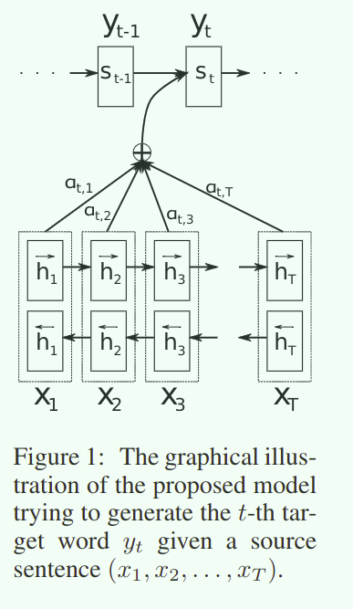
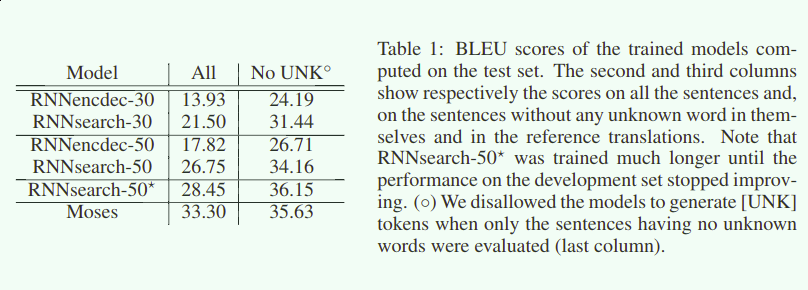
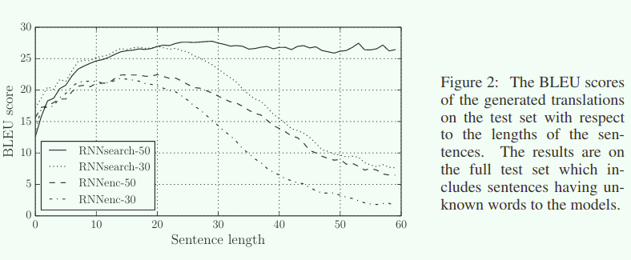

## Neural Machine Translation By Jointly Learning To Align And Translate

>The first paper introduce the attention  into the Seq2Seq framework

[TOC]

---

### 1. 摘要

神经机器翻译是最近的研究热点，并不像传统的统计机器翻译一样，神经机器翻译意图使用一个统一的神经网络调整以最大化翻译表现能力。最近的提出的神经机器翻译的主要方法都在使用 `encoder-decoder` 框架，通过将变长的序列压缩表示成定长的向量，再通过使用解码器将定长的向量恢复成变长的新的序列。但是在本文中，**有根据的认为定长的向量表示是提升 `encoder-decoder` 框架性能的瓶颈**，为了解决这个问题，提出方法通过使用模型自动的搜索源序列中和当前的预测的目标序列的单词相关的部分，扩展这种压缩的表示方法。通过这种方法，在英法翻译任务中，达到了和现有的最好的基于短语对的翻译系统一样的性能表现，并且定性分析显示模型学习到了翻译中的 `软对齐`。

### 2. Introduction

和现有的统计机器翻译的方法不同，神经机器翻译试图构建和训练一个单一的巨大的神经网络来实现输入序列并直接得到翻译结果。目前的大多数的翻译模型都是基于 `encoder-decoder` 框架构建的，通过共同训练最大化正确的翻译对的概率进行训练。

但是针对 `encoder-decoder` 的一个潜在的问题就是 **神经网络需要将源序列的所有必要信息压缩到一个特定长度的向量中**，这一点可能会使得神经网络难以应对长序列(信息过多，压缩中出现信息损失)，尤其是长度比训练集中的句子长的时候。最新的研究结果显示，`encoder-decoder` 框架的性能在面对输入序列的长度增加的时候会出现剧烈的衰减。

为了解决这个问题，我们针对 `encoder-decoder` 框架引入了一种扩展机制试图同时学习翻译和序列对齐。每当模型生成翻译的时候，attention 试图在源序列中寻找和当前的信息相关度最高的部分生成新的文本压缩向量，然后模型基于这个新的文本压缩向量和之前的 `decoder` 生成的信息预测出当前的这个单词。

**新的模型和 `encoder-decoder` 之间的主要区别在于框架并不试图将输入序列编码到特定长度的向量中，他还会在解码翻译的过程中选择最适合翻译的源序列中的成分，这一点使得框架从将所有的信息压缩(不论输入序列的长度)到一个特定维度的向量中释放出来**，我们的方法在解决长句子的问题中表现的更好。

在本文中，我们的模型有效的提升了基础的 `encoder-decoder` 方法的翻译性能，这一点虽然可以在所有的句子长度的粒子中国都可以观察到，但是在长句子中可以看的更加的清楚。模型的效果不仅接近了传统的基于短语的系统，并且我们通过定性的分析发现提出的模型在输入和输出序列对中找到了语言学规律上的软对齐。

### 3. 背景介绍

从概率的角度上来说，翻译任务是给定输入序列 $$x​$$,最大化寻找概率 $$y​$$ 的目标，即计算 $$\arg\max_yp(y|x)​$$ 如果模型训练结束，可以通过最大化条件概率采样生成新的序列。目前常用的解析的框架方式就是使用 `encoder=decoder` 来进行翻译任务。虽然是一个新的方法，但是神经机器翻译已经展现出了很好的结果。

#### RNN Encoder-Decoder

我们的方法在 `encoder-decoder` 上建立了新的模型框架，这里我们先来进行`encoder-decoder`框架的描述。在 `encoder-decoder` 框架中，`encoder` 负责读入输入序列 $$x=(x_1,...,x_{T_x})$$ 编码到一个特定维度的向量 $$c$$，最常用的方法就是使用 RNN
$$
\begin{array}{ll}
h_t=f(x_t,h_{t-1})\\
c=q({h_1,...,h_{T_x}})
\end{array}
$$

* $$h_t$$ 是第 $$t$$ 时间步上的隐含层状态
* $$c$$ 是编码的内容向量
* $$f,q$$ 都是非线性激活函数，一来说 $$f$$ 是 LSTM，$$q(h_1,...,h_{T_x})＝h_T$$

`decoder` 的任务是根据内容向量 $$c$$ 和之前的预测结果 $$\{y_1,...,y_{t'-1}\}$$ 预测下一个 $$y_{t'}$$ ，换句话来说， `decoder` 负责计算一个概率
$$
\begin{array}{ll}
p(y)=\Pi^{T}_{t=1}p(y_t|\{y_1,...,y_{t-1}\},c)\\
p(y_t|\{y_1,...,y_{t-1}\},c)=g(y_{t-1},s_t,c)
\end{array}
$$

* $$g$$ 是非线性函数，用来输出 $$y_t$$ 的概率分布
* $$s_t$$ 是RNN的隐含层输出

### 4. 同时学习对齐和翻译

在本文中主要解释新的网络架构，`encoder` 是一个双向的 RNN，`decoder` 在解码的时候在输入序列上寻找对齐输入

#### 4.1 Decoder

$$
\begin{array}{ll}
p(y_i|y_1,...,y_{i-1},x)=g(y_{i-1},s_i,c_i)\\
s_i=f(s_{i-1},y_{i-1},c_i)
\end{array}
$$

值得注意的是，在传统的 `encoder-decoder` 框架中的 $$c_i$$ 是固定的，但是在这里我们的 $$c_i$$ 是针对每一个不同的要预测输入 $$y_i$$  的

$$c_i$$ 依赖于之前输入序列的隐含层输出 $$(h_1,...,h_{T_x})$$ 每一个 $$h_i$$ 包含了整个序列的信息(双向的 RNN)但是将主要的信息几种在附近的输入序列元素上。
$$
\begin{array}{ll}
c_i=\sum_{j=1}^{T_x}\alpha_{ij}h_j\\
\alpha_{ij}=\frac{\exp(e_{ij})}{\sum_{k=1}^{T_x}\exp(e_{ik})}\\
e_{ij}=a(s_{i-1},h_j)
\end{array}
$$

正如上图和上式所示，拜托了原本的 `encoder-decoder` 框架中的固定的修正维度的向量的限制，在这里的每一个文本内容向量都是需要在输入序列上执行注意力机制生成的。这就是本文提出的对齐模型，这显示了输入序列中的那一部分和当前的要预测的输出内容(这一点实在 $$s_i$$ 上体现出来的)是最相关的，对于 $$a$$ 我们使用前馈神经网络实现，这一网络和 `encoder-decoder` 一起利用反向传播训练。

概率 $$\alpha_{ij},e_{ij}$$ 体现出来了输入序列的隐含输出 $$h_j$$ 对当前的 $$s_{i-1} (i状态)$$ 的贡献的重要程度 ，直觉上这就是一个注意力模型，通过注意力模型，我们将 `encoder` 将这个输入序列的信息压缩到一个特定的向量的负担中解放出来，这个新的方法可以将信息传播到序列的隐含输出中(而不是特定的 $$c$$)，之后再被 `decoder` 用来选择。

#### 4.2 Encoder

为了保证每一个隐含层都考虑到了整个序列的所有信息，我们的`encoder` 使用双向 RNN实现。双向 RNN 存在有前向和后向两个 RNN
$$
\begin{array}{ll}
\overrightarrow{f}(x_1,...,x_{T_x}) = (\overrightarrow{h_1},...,\overrightarrow{h_{T_x}})\\
\overleftarrow{f}(x_1,...,x_{T_x}) = (\overleftarrow{h_1},...,\overleftarrow{h_{T_x}})\\
h_j=[\overrightarrow{h_j},\overleftarrow{h_j}]
\end{array}
$$

 ### 5. Experiment

实验两种模型，第一个是 RNN `encoder-decoder` 另一个是新的提出的模型 RNNSearch，每一个模型都训练两次，句子的长度分别是 30和50得到 RNNencdec-30, RNNsearch-30,RNNencdec-50,RNNsearch-50

* RNNencdec的 `encoder-decoder` 都有 1000 个隐含层单元，RNNsearch 的 `encoder` 中前后两个过程都有1000个隐含层单元,`decoder`也是1000个隐含层单元使用 `maxout` 计算最终的概率分布
* SGD + minibatch(80) + Adadelta	
* 训练了 5 天
* 使用 beam-search 进行解码寻找最优翻译

### 6. Result

#### 6.1 定量分析

比传统的 `encoder-decoder` 优秀，和最新的基于短语对的翻译系统效果基本一致

在长句子的表现方面，新提出的框架可以解决长句子的问题，句子的长度不再是限制 `encoder-decoder` 的瓶颈

#### 6.2 定量分析对齐模型

论文的混淆矩阵图

### 7. 总结

长句子上 `encoder-decoder` 可能会遇到问题，但在本文中提出的新的注意力机制解决了这个问题，当生成一个新的序列元素的时候强制要求在输入句子的隐含表示上寻找特定的相关的部分。这一点将信息分布在了输入序列的隐含表示上而不是维度固定的向量，并且让模型将信息关注到更有关的部分上，这些部分都是一起训练的。

通过实验我们可以发现模型可以学习到软对齐，将目标单词和有关的单词(或者说是他们的隐含表示)对齐，未来的研究方向是更好的处理未登录次和低频词，这样模型在所有的情况下比现有的最好的翻译系统(Moses)要优秀。

### 8. 模型架构

首先需要说明的是，这是一个通用的经典框架，可以被任何任务具体定义，比如可以自己定义 $$f,a$$ 可以使用 LSTM 或者其他的对齐模型，这部分主要解释本文试验中使用的架构。

#### 8.1 RNN

GRU，其中的门使用 sigmoid 和 tanh，用来学习长期依赖

> encoder

$$
\begin{array}{ll}
x=(x_1,...,x_{T_x}),x_i\in \mathbb{R}^{K_x}\\
y=(y_1,...,y_{T_y}),y_i\in \mathbb{R}^{K_y}\\
\overrightarrow{h_i}=\left\{\begin{array}{rcl}
(1-\overrightarrow{z_i})\circ\overrightarrow{h_{i-1}} + \overrightarrow{z_i}\circ\overrightarrow{h_i'} & ,if\ i>0\\
0 &,if\ i=0
\end{array}\right.\\
\overrightarrow{h_i'}=\tanh(\overrightarrow{W}Ex_i+\overrightarrow{U}[\overrightarrow{r_i}\circ \overrightarrow{h_{i-1}}])\\
\overrightarrow{z_i}=\sigma(\overrightarrow{W_z}Ex_i+\overrightarrow{U_z}\overrightarrow{h_{i-1}})\\
\overrightarrow{r_i}=\sigma(\overrightarrow{W_r}Ex_i+\overrightarrow{U_r}\overrightarrow{h_{i-1}})\\
h_i=[\overrightarrow{h_i},\overleftarrow{h_i}]
\end{array}
$$

> decoder 的计算流程

$$
\begin{array}{ll}
s_i=f(s_{i-1},y_{i-1},c_i)=(1-z_i)\circ s_{i-1}+z_i\circ \overline{s_i} \\
\overline{s_i}=\tanh(We(y_{i-1})+U[r_i\circ s_{i-1}]+Cc_i)\\
z_i=\sigma(W_zEy_{i-1}+U_zs_{i-1}+C_zc_i)\\
r_i=\sigma(W_rEy_{i-1}+U_rs_{i-1}+C_rc_i)\\
s_0=\tanh(W_s\overleftarrow{h_1})\\
\end{array}
$$

* $$\circ$$ 是element-wise 的乘积计算
* $$e(y_{i-1})$$ 是对 $$y_{i-1}$$ m维的embedding
* 最后的概率输出不使用softmax使用maxout

#### 8.2 对齐模型

$$
\begin{array}{ll}
c_i=\sum_{j=1}^{T_x}\alpha_{ij}h_j\\
\alpha_{ij}=\frac{\exp(e_{ij})}{\sum_{k=1}^{T_x}\exp(e_{ik})}\\
e_{ij}=v_a^T\tanh(W_as_{i-1}+U_ah_j)\\
a(s_{i-1},h_j)=v_a^T\tanh(W_as_{i-1}+U_ah_j)
\end{array}
$$

* $$W_a$$: (n, n) 矩阵
* $$U_a$$: (n, 2n) 矩阵
* $$v_a$$: (n,) 向量，将最后的结果转换成标量
* $$U_ah_j$$ 不需要依赖 $$i$$，所以可以预先计算出来

