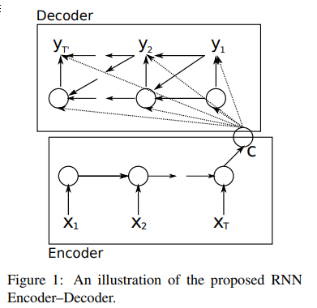
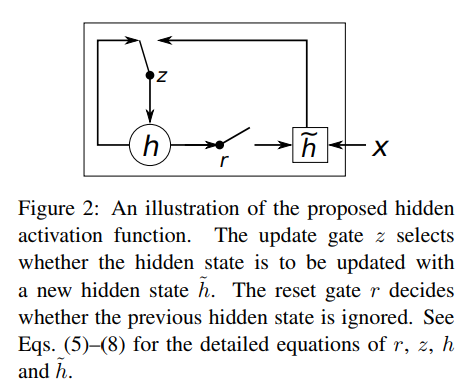
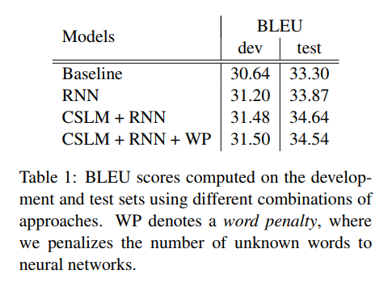

## Learning Phrase Representation using RNN Encoder-Decoder for SMT

---

[TOC]

### 1. 摘要

在本次论文中，提出了新颖的网络架构称之为 `RNN Encoder-Decoder` ，该网络由两部分循环神经网络构成，其中一部分称之为 `Encoder` 负责将变长的序列编码成定长的向量，另一部分称之为 `Decoder` 负责将定长的向量解码成变成的另一种序列。在训练过程中，编码器和解码器共同训练以最大化输入序列和输出序列的条件概率。通过利用该网络架构对短语对进行翻译并加入到传统的统计翻译模型的一部分之后，翻译模型的效果有所提升。并且在本文中，通过定性的分析，解释提出的模型可以有效的学习出符合语义和句法结构的语言规则的表示。

---

### 2. 介绍

深度神经网络在目标检测，语音识别等等领域已经获得很大的成功，此外，最近的很多工作揭示了神经网络也可以有效的应用在 NLP 的相关任务中。本文中主要引入了新的神经网络架构意在提高统计翻译模型的效果。

* 本文提出一种新的神经网络架构: `RNN-Encode-Decoder`
* 本文介绍一种新的神经元结构，目的是为了减少训练时的内存消耗和简化训练的过程 `GRU`

基于 `GRU` 的 `Encoder-Decoder` 框架在试验中主要用来解决英语到法语的翻译问题，我们训练模型去学习英语短语到法语短语的翻译概率。之后训练的模型用来在 SMT 中对短语表中的短语对进行打分，实验结果显示，使用 `Encoder-Decoder` 的对短语打分提高了翻译的效果。

通过将得到的短语的翻译概率和已有的模型的短语打分的比较之后，定性的对 `Encoder-Decoder` 进行分析显示 `Encoder-Decoder` 在捕获语言规律方面表现更好，并且间接的提高了 SMT 的全局翻译效果。更深入的分析也指出，新的网络架构学习到了可以保留语义和句法结构的连续空间表示方法。

---

### 3. RNN Encoder-Decoder

#### 3.1 RNN

循环神经网络是一种神经网络架构，通过操作输入序列 $$x$$， 生成隐含层 $$h$$，和可选的输出层 $$y$$，在每一个时间步上隐含层的更新公式是
$$
h_{<t>}=f(h_{<t-1>},x_t)
$$
其中 $$f$$ 可以是一个普通的非线性激活函数，也可以是一个复杂的函数架构，比如说 LSTM。一个 RNN 架构的神经网络可以通过预测序列中的下一个元素，有效的学习一个序列的概率分布。概率分布可以通过 softmax 函数输出。
$$
p(x_{t,j}=1|x_{<t})=\frac{exp(w_jh_{<t>})}{\sum_{j'=1}^{K}exp(w_{j'}h_{<t>})}
$$
其中 $$w_j$$ 表示矩阵 $$W$$ 中的行向量。通过这些概率计算的方式，可以计算出一个序列的采样概率。
$$
p(x)=\Pi_{t=1}^{T}p(x_t|x_{<t})
$$

#### 3.2 RNN Encoder-Decoder

在本文中，我们提出一种新颖的网络架构，学习将变长的序列编码成定长的向量，然后将定长的向量解码成变长的序列。从概率的角度来说，这种新的模型学习序列到序列的条件概率分布 $$p(y_1,...,y_{T'}|x1,...,x_T)$$ 需要注意的是，序列的长度可以是不同的。

`Encoder` 有序的读取输入的序列，在读取完整个序列的时候，输出一个向量 $$c$$ 作为对整个输入序列的摘要。`Decoder` 通过给定隐含层状态 $$h_{<t>}$$ 预测下一个符号 $$y_t$$ 生成新的序列。可以得到 `Decoder` 的计算公式
$$
h_{<t>}=f(h_{<t-1>},y_{t-1},c)\\
P(y_t|y_{<t},c)=g(h_{<t>},y_{t-1},c)
$$
需要注意的是，$$g$$ 函数需要输出一个合理的归一化概率分布，一般来说都是 softmax 函数。

`Encoder,Decoder` 共同训练，最大化条件似然函数
$$
\max_{\theta}\frac{1}{N}\sum_{n=1}^{N}\log p_{\theta}(y_n|x_n)
$$
其中， $$\theta$$ 是模型的参数，$$(y_n,x_n)$$ 是输入和输出序列对，模型架构是可微(存在有求导链)的换句话来说，可以使用标准的梯度下降算法优化模型的参数。模型一旦训练完毕，可以应用在两个方面中，一种是给定输入序列生成目标序列，另一种是对给定的输入和输出序列打分(分数是$$p_{\theta}(y|x)$$，通过采样计算出对应的输出序列的条件概率的乘积作为分数)

#### 3.3 GRU

文章经过 LSTM 的启发，还提出了一种新的隐藏层单元，用来简化计算和实现，新的隐藏层单元计算架构如下
$$
r_j=\sigma([W_rx]_j+[U_rh_{<t-1>}]_j)\\
z_j=\sigma([W_zx]_j + [U_zh_{<t-1>}]_j)\\
h^{<t>}_j=z_jh^{<t-1>}_j+(1-z_j)\bar{h^{<t>}_j}\\
\bar{h^{<t>}_j}=\phi([Wx]_j+[U(r\odot h_{<t-1>})]_j)
$$

* $$r_j, z_j, h_j$$: 表示第 $$j$$ 个隐含层单元的计算
* $$r_j$$: 重置门
* $$z_j$$: 更新门
* $$\bar{h^{<t>}_j}$$: 更新值
* $$\phi$$: 非线性激活函数，一般是 tanh
* $$\sigma$$: sigmoid 函数，其中的 $$[]_j$$ 的含义是对向量中的第 $$j$$ 个元素都统一做 sigmoid 计算
* $$\odot$$: 其实不论是 $$\odot$$ 还是 $$h_j^{<t>}$$ 计算中的乘法都是逐元素计算的，每一个隐含层向量的元素可以表示一个特征，每一个特征的操作都是不一样的。

当重置门的值关闭为0的时候，隐藏层强制遗忘掉之前的记忆并用当前的记忆重置，重置门的作用在于有效的学习遗忘掉不相关的信息从而学习到序列更紧凑的表示。更新门用来控制前一个隐藏层到当前的隐藏层需要保留多少信息，这一点和 LSTM 很相似。

这么构建隐藏层的目的在于学习捕捉不同时间长度上的依赖，在试验中会发现门是隐藏层学习的关键，没有门结构没有办法学习到任何有意义的特征。

---

### 4. SMT

统计机器翻译目的是对任意的输入句子 $$e$$ 寻找到合适的翻译结果 $$f$$ ，并最大化条件概率(这里需要引入噪声信道模型)

>SMT 又称统计机器翻译，通过对大量的平行语料进行统计分析，构建统计翻译模型，以使用此模型进行翻译。首先的任务是为语言的产生构造某种合理的统计模型，并在此基础上定义要优化的模型参数并设计模型参数优化算法。过去通常使用噪声信道模型(无监督)现在大部分时候用区分训练的有监督方法。

$$
p(f|e)\propto p(e|f)p(f)
$$

如上所示就是标准的噪声信道模型，在统计机器翻译的时候，我们为了得到对待翻译语言 $$e$$ 的目标语言 $$f$$ 的翻译，首先人会在大脑内构建一个对输入句子内容的 $$f$$ 语言文本，通过一个噪声信道 (口腔) 将其输出出来得到。其中 $$p(f)$$ 叫做语言模型(用于决定该序列是否存在意义，是否是符合 $$f$$ 语言的表示) ，$$p(e|f)$$ 叫做翻译模型。实际中，大部分的 SMT 建模对数线性模型，引入额外的特征和权重。
$$
\log p(f|e)=\sum_{n=1}^Nw_nf_n(f,e)+\log Z(e)
$$
其中 $$Z(e)$$ 是归一化常量，并不存在参数，权重通过最大化 BLEU 分值进行调整。

神经网络已经广泛的引用在 SMT 系统中，在大多数情况下，神经网络都是用来对翻译假设进行打分。但是最近，用神经网络来训练对句子或者是短语的**表示**打分变得更吸引人。

#### 4.1 使用 `Encoder-Decoder` 对短语对打分

文中提议，在调整 SMT 系统的时候，可以使用 `RNN Encoder-Decoder` 对短语对打分来提高翻译的效果。但是在训练语料的时候，我们需要忽略语料库中的词频的影响，这样带来的好处有两点

* 减少根据归一化的频率随机选取短语的计算开销
* 确保 RNN 很少学习按照词频对短语排名

之所以这么做的原因在于，翻译的概率已经包含有语料库中词频的一些重要的信息，这样可以确保大部分的网络的参数用来学习语言规律。

当 `RNN Encoder-Decoder` 训练完成，我们添加对 SMT 已有的短语表中添加一个新的分数。但是从另一方面来看，实际上 `RNN Encoder-Decoder` 本质上可以替代 SMT 中的短语表，这样需要 `RNN Encoder-Decoder` 需要生成一系列的目标短语，但是这不是文章的研究范围。	

#### 4.2 相关工作-机器翻译中的神经网络方法

1. Schwenk 在 2012 年提出了一种相似的方法用来对短语对打分，但是没有使用 `RNN` ，他使用了固定输入和输出大小的前馈神经网络(大小是7不足的用0补齐)，但是本文中的 `Encoder-Decoder` 可以很自然的处理这种变长的结构。
2. Devlin 在 2014 年提出了使用前馈神经网络建模一个翻译模型，但是每一次值预测目标短语中的一个单词，这种方法的效果非常的显著，但是这种方法还是需要收到最大输入长度的限制。
3. Zou 在 2013 年提出了学习对单词和短语的双语映射方法，通过映射之后计算相似度作为 SMT 短语表中的打分的额外信息。
4. Chandar 在 2014 年提出了用前馈神经网络将输入词袋映射到输出词袋的方法，这一点和 `RNN Encoder-Decoder` 非常相似。
5. Socher 在 2011 年提出了用两个 RNN 对输入和输出进行映射，但是这一种方法的模型适用于单语模型，用来重建原有的输入语言的序列。
6. 本文中的方法和之前的很多的类似的方法(Zou 2013, Chandar 2014)的主要区别在于考虑了序列的顺序关系。
7. 最接近的方法是 Kalchbrenner and Blunson, 2013 他们也采用了 `Encoder-Decoder` 架构，但是区别在于他们的模型使用 CNN 作为 Encoder，使用 CNN + RNN 混合作为 Decoder。

---

### 5. 实验

#### 5.1 数据和基线系统

* 级联的语料训练不好，并且导致模型参数极多，不适合训练和处理
* 本文使用的语料库中的单词覆盖 93% 并对未登录词用 UNK 处理

#### 5.2 RNN Encoder-Decoder

本文的实现中，使用的隐含层单元的数目是 1000，词向量大小是 100，激活函数是 tanh 和 sigmoid 解码器中的从隐含层到输出层的是单个中间层的神经网络，隐含层大小是 500。所有的参数初始化都是从均值是0方差是0.01的高斯分布中采样得到的。使用了 Adadelta 动量控制和 SGD ，模型训练了大约三天。

#### 5.3 神经语言模型

为了准确的评估 `RNN Encoder-Decoder` 对 SMT 的改良效果，我们将 `RNN Encoder-Decoder` 和标准的 CSLM 进行对比实验，从而判断 `RNN Encoder-Decoder` 和 CSLM 之间对 SMT 的效果提升是否是冗余的还是独立的。 

#### 5.4 定量分析

实验组合

* Baseline
* Baseline + RNN
* Baseline + CSLM + RNN
* Baseline + CSLM + RNN + Word penalty

如上图所示，明显说明， CSLM 和 `RNN Encoder-Decoder` 对 SMT 的贡献是不冗余的并且可以独立的获得明显的效果提升。深入研究的话，对未登录词的出现数目进行惩罚，但是这样的改进仅仅增大了 Dev 数据集的效果。

为了理解性能改进的来源，我们分析了 `RNN Encoder-Decoder` 得到的短语的分数和相关的翻译模型的的翻译概率。由于现有的翻译模型完全的依赖于语料库中的统计数据，我们期望传统的方法的分数对高频词的分数很大，对低频词的分数很小。但是 `RNN Encoder-Decoder` 并不学习这种词频信息。

通过实验发现，`RNN Encoder-Decoder` 对高频词的分数也很高，并且表达更加的简洁，但是更有趣的是，虽然很多的翻译结果是相似的，但是也有很多的翻译结果的打分情况是完全不同的，这一点是因为 `RNN Encoder-Decoder` 阻止学习频率导致的。

#### 5.5 词和短语表示

连续空间语言模型可以有效的学习到有意义的语义嵌入，并且 Encoder 也可以实现这一目标。学习到合理的语义和句法结构的表示。

---

### 6. 扩展资料

$$
X=(x_1,x_2,...,x_N)\ \ \ \ \ \# one-hot \\
Y=(y_1,y_2,...,y_M)\ \ \ \ \ \ \ \ \ \ \ \ \ \ \ \ \ \ \ \ \ \ \ \ \
$$

1. Encoder
   $$
   h_j^{t}=z_jh_j^{<t-1>}+(1-z_j)\bar{h_j^{<t>}}\\
   \bar{h_j^{<t>}}=\tanh([We(x_t)]_j + [U(r \odot h_{<t-1>})]_j)\\
   z_j=\sigma([W_ze(x_t)]_j+[U_zh_{<t-1>}]_j)\\
   r_j=\sigma([W_re(x_t)]_j+[U_rh_{<t-1>}]_j)\\
   c=\tanh(Vh^{<N>})
   $$

   * 初始化 $$h_j^{<0>}$$ 的值是 0
   * $$c$$ 向量需要通过 $$\tanh$$ 函数将最后一个隐含层的结果通过激活输出
   * $$e(x_i)$$ 是500维的向量，隐含层单元是 1000 个

2. Decoder
   $$
   h'^{<0>}=\tanh(V'c)\\
   {h'}_{j}^{<t>}=z'_j{h'}_j^{<t-1>}+(1-z_j)\bar{{h'}_j^{<t>}}\\
   \bar{{h'}_j^{<t>}}=\tanh([W'e(y_{t-1})]_j + r'_j[U'h'^{<t-1>}+Cc])\\
   z'_j=\sigma([W'_ze(y_{t-1})]_j+[U'_zh'_{<t-1>}]_j+[C_zc]_j)\\
   r'_j=\sigma([W'_re(y_{t-1})]_j+[U'_rh'_{<t-1>}]_j+[C_rc]_j)
   $$

   * $$e(y_0)$$ 是全 0 的向量

   * 不同于编码器，解码器还需要学习生成目标短语，通过 softmax 将概率分布输出。相当于学习如下概率分布
     $$
     p(y_{t,j=1}|y<t,X)=\frac{exp(g_js_{<t>})}{\sum_{j'=1}^{K}exp(g_{j'}s_{<t>})}
     $$
     输出层的神经网络架构如下
     $$
     s_i^{<t>}=max\{{s'}_{2i-1}^{<t>},{s'}_{2i}^{<t>}\}\\
     s'^{<t>}=O_hh'^{<t>}+O_yy_{t-1}+O_cc
     $$

     * $$O_h, O_y, O_c$$: 是将当前的隐含层输出和上一步的概率结果和输入短语表示混合输出构建向量
     * $$g$$ 是 $$G$$ 矩阵的参数，并且 $$s$$ 向量大维度大小是 1000
     * 简单来说 $$s_i^{<t>}$$ 是一个 $$maxout$$ 单元