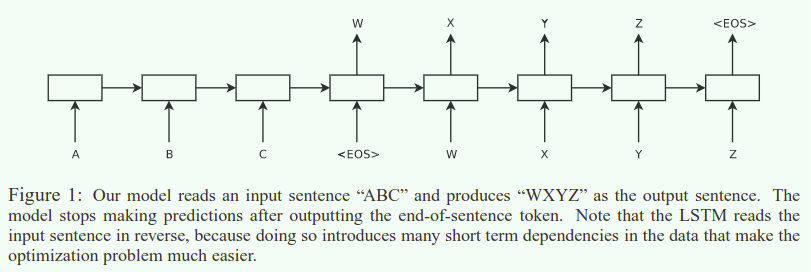

## Sequence to Sequence Learning with Neural Networks

[TOC]

---

### 1. 摘要

虽然神经网络很强大，但是目前而言，神经网络和没有办法学习到序列到序列之间的映射，在本文中，作者提出了一种通用的端到端方法用来学习序列之间的映射关系，我们的论文中使用了多层堆叠的 LSTM 映射输入序列到一个确定维度的向量，然后另一个深度 LSTM 从这个向量中解码出另一个序列，并且在法语到英语的翻译任务中获得了很大的性能提升，额外的，我们发现 LSTM 在学习长序列上并没有出现困难，并且 LSTM 网络成功的学习到了对词序和主动被动语态不变性的的短语和句子的表示。最后我们发现，逆转输入序列的顺序可以提升网络的表现性能，原因是因为引入了很多的短期依赖并且使得优化更容易。

### 2. Introduction

虽然神经网络和传统的统计模型是相关的，但是他们一种复杂的计算过程。此外，如果监督数据足够特征化网络的参数的话，使用反向传播的监督学习是非常有效的。但是虽然神经网络非常有效灵活，但是深度神经网络只能被用来解决输入和输出维度确定的问题，这是一个很严重的问题，因为很多重要的问题都是变长的，因此，**一个对领域独立的学习序列到序列映射的方法是非常重要的**。

在本文中，引入了 `Seq2Seq` 模型的架构，其中`encoder` 部分一个时间步一个时间步的阅读序列，然后输出一个长度确认特征表示向量，然后使用一个另一个 LSTM 网络从这个向量中解码输出另一个序列， `decoder` 本质上是一个以输入序列为条件的循环神经网络构建的语言模型。为了应对长序列的问题，这里采用了 LSTM 神经网络实现。

令人意外的是，LSTM 并没有受困与长序列(和最近的一些相关的工作相比较发现)，我们通过将输入序列逆序的方式取得很好的表现。

LSTM 一个有趣的特性就是学习将变长输入序列映射到固定维度的向量表示中，意思相近的句子通过网络之后可以得到相近的网络表示结果，另外定性的分析发现，当前的提出的模型可以学习到词序和主动被动语态的不变形。

### 3. The model

输入序列 $$(x_1,...,x_T)$$ 一个标准的循环神经网络通过迭代下列的表达式计算输出 $$(y_1,...,y_T)$$
$$
\begin{array}{ll}
h_t=\sigma(W^{hx}x_t+W^{hh}h_{t-1})\\
y_t=W^{yh}h_t
\end{array}
$$
通过 `Seq2Seq` 的方法可以有效的进行序列到序列之间的映射，因为本质上 RNN 提供了所有的有关的信息，并且使用 LSTM 可以有效的解决这个长输入的依赖问题，其中的 LSTM 作用在于预测 $$p(y_1,...,y_{T'}|x_1,...,x_T)$$ ，`encoder` 通过压缩获得语义向量 $$v$$，然后在 `decoder` 计算概率
$$
p(y_1,...,y_{T'}|x_1,...,x_T)=\Pi^{T'}_{t=1}p(y_t|v,y_1,...,y_{t-1})
$$
其中的概率分布使用 softmax 的形式表现出在整个词典上的概率分布，上式迭代直到遇到了句子终结符号 <EOS>

模型的创新点:

* 使用了 `encoder`, `decoder` 两种循环神经网络，并且参数的增加并不会提高计算的复杂度

* 深度的网络比浅层的网络表现效果更好，本文试验中使用了 4 层

* 翻转输入序列的顺序可以提升性能，例如

  将序列从 $$a,b,c$$, 映射成 $$\alpha,\beta,\gamma$$ ，但是实际上我们执行的是映射 $$c,b,a$$ 到 $$\alpha,\beta,\gamma$$ ，原始的平均距离是 3, 之后的平均距离是 3，但是最开始的序列的映射是非常短时的，并且在序列中考虑词序的话，如果最开始的序列学习的依赖关系比较好的话，之后的概率提升比较大。

### 4. Experiments

我们在法语到英语的翻译任务中，直接翻译输入序列(和之前的一篇不同)

#### 4.1 解码和重新打分

核心在于我们的实验在很多的句子对上训练一个大型的深的 LSTM 神经网络，通过最大化负对数似然函数进行优化，训练完之后最后采用概率最大化采样获得最佳的翻译序列。在解码的时候采用 beam-search 的方法获得输出的序列。

#### 4.2 翻转输入序列的

论文中的原话是，目前对翻转输入序列的可以极大的提高模型的表示能力的这个方法目前没有一个确定的解释，但是可以相信的是该方法确实引入了很多的短时依赖。单词之间的平均距离没有改变但是之前的几个单词的举例变得非常的近，从而提高了整体的表现能力。

论文作者认为，翻转输入序列可以在最开始解码的时候生成更有信服能力的结果，但是在最后的部分生成并不是很有信服力的结果。然而，LSTM 翻转后的训练结果显示模型的表现能力得到了显著的提升，并且内存的应用生也得到了优化。

#### 4.3 训练细节

LSTM 是非常容易训练的，使用了 4 层的深度 LSTM，隐藏层的大小是 1000，词嵌入的维度是 1000，输入词典大小是 160000输出词典大小是 80000，在最后结果输出的时候使用了 80000 大小的 softmax

* LSTM 的参数是 -0.08 ~ 0.08 之间的均匀分布
* 使用学习率是 0.7 没有动量的随机梯度下降，5个epoch之后学习率减半，总共训练了 7.5 和 epoch
* batch 大小是 128
* 虽然不容易发生梯度消失，但是在训练过程中出现了梯度爆炸，达到了阈值之后强制使用了归一化
* 不同的句子的长度不同，大多数都是短句子(20~30)，有事后句子很长(>100)所以一个 128 大小的minibatch 中会有很多的短句子很少的长句子，在 minibatch 中的大多数计算都是浪费的，为了解决这个问题我们大致将所有的句子保持相同的大小，可以获得大概2被的加速效果。

