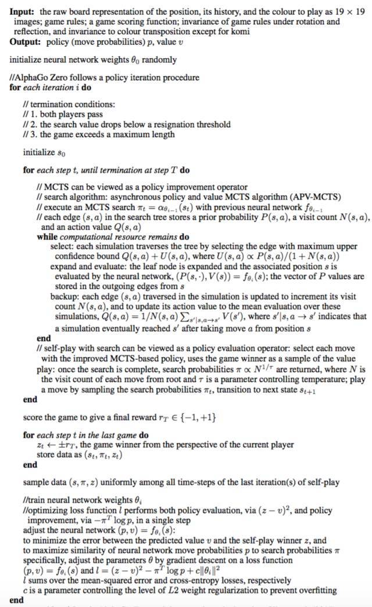

## AlphaZero 论文笔记

---

[TOC]

---

### 1. AlphaGo

> 为了更好的了解 **`AlphaZero`**，有必要了解一下 **`AlphaGo`** 算法的思想，在核心的算法上，这两种算法本质上是一脉相承的

#### 1.1 问题分析和抽象

**`AlphaGo`** 算法本质上是为了解决围棋问题的，我们在这里首先对围棋问题进行有必要的数学抽象

1.  围棋总共有 __19 * 19 = 361__ 个棋盘点可以走子，每一个点可以用三种状态形容 (1 - 白棋，-1 - 黑棋，0 - 空白)，因此，每一盘棋局可以使用一个 361 维的向量进行描述，如下
   $$
   \overline{s}=(1,0,-1,...,0,0,0)
   $$

2. 走子情况也可以抽象为一个 361 维的one-hot向量来进行描述，(0 - 不走子，1 - 走子)，当然也可以采用softmax的概率形式来表现。
   $$
   \overline{a}=(0,0,0,...,1,0,0)
   $$

3. 围棋问题的数学抽象

   给定一个任意状态 $$\overline{s}$$ ,寻找一种最优的策略 $$\overline{a}$$ 保证可以获得围棋上最多的地盘，当然如果要将问题迁移到其他的棋类问题上的话，最优策略需要进行调整。

#### 1.2 解决方法

1. CNN

   在 __`AlphaGo`__ 之前已经有人尝试过使用 CNN 来解决围棋问题。

   给定围棋的局面 $$\overline{s}$$ 作为输入，高水平的人类棋手的在该局面下的走子 $$\overline{a}$$ 作为监督信息，对 CNN 进行训练，得到一个和高水平的人类棋手走子风格极其相似的模型，即求得映射:
   $$
   \overline{a}=f(\overline{s})
   $$
   需要注意的是，这里的 $$\overline{a}$$ 不是 one-hot 的向量，而是一个掺杂有概率信息的概率向量。通过这种方法训练得到的模型，我们又称作 **策略网络**。

   但是这样的网络的表现并不是很好，主要原因可能在于这么几点。

   * 训练的数据中不免出现很多的不好的走子，影响模型的表现
   * 模型只是走子风格和人类相似的，并不具备有搜索有价值点的能力

2. MCTS

   在 __`AlphaGo`__ 之前的最好的围棋程序是 `CrazyStone`, 该程序使用的就是 MCTS (Monte-Carlo Tree Search) 蒙特卡洛树搜索算法。

   算法的核心思想在于**大量的模拟可以凸显出最有价值的策略**。当然这种大量的模拟是建立在随机的基础上的。算法的部分流程如下:

   * 围棋初局 $$\overline{s_0}$$ ，**等概率随机**走子($$\frac{1}{361}$$) $$\overline{a_0}$$
   * 对手同样采用随机走子的策略继续棋局
   * 重复上述步骤直到棋局分出胜负，完成一局棋局的模拟，可以得到信息(1 - 胜利，0 - 失败)

   更新走子 $$(\overline{s_0},\overline{a_0})$$ 走子的信息，下次模拟的时候就不是等概率的随机走子，采用按照概率的采样的方式，看起来更好的走子的分数会变得越来越高，模拟的次数也会越来越多，如果模拟的棋局数目足够多，棋力越高。

   模拟一定次数之后，选择分数最高的走子 $$(\overline{s_0},\overline{a_0})$$ 的走子 $$\overline{a_0}$$ 作为一次有效的走子，**棋局真正的发生变化**，这个步骤的学名又叫做 **rollout**。

   1. MCTS 算法的优点

      * 算法可以并行
      * 算法可以在对手思考的同时继续运算
      * 棋力和模拟的次数基本上成正比

   2. MCTS 算法的缺点

      初始策略过于简单，在初局的模拟次数不够的情况下，随机走子的效果并不是很好。但是反观人类棋手在初始棋局的时候都会选择有很大优势的 **定式** 等等方式快速的开辟局面。

3. MCTS + CNN

   应对 MCTS 算法缺陷的方案是显而易见的，我们可以采用 CNN 训练得到的 **策略网络** 生成下一步走子的概率分布作为 MCTS 走子的参考，MCTS 在 **策略网络** 的输出 $$\overline{a}$$ 的基础上采样选择一个走子方案，并按照 MCTS 算法的框架不断的模拟。

   但是这样会带来另一个问题，CNN 提供的走子策略概率采样得到的棋局模拟的多样性是会减少的，并且通过大量的模拟会出现 **模拟的得到结果** 好于 CNN 提供的结果。这时候我们需要慎重的考虑分数的计算问题。
   $$
   NewScore = \frac{P_{Policy}(\overline{s})}{Search + 1} + P_{Monte}
   $$

   * $$NewScore$$: 计算走子的分数
   * $$P_{Policy}$$: 策略网络
   * $$Search$$: 走子方案模拟的次数
   * $$P_{Monte}$$: 蒙特卡洛模拟得到的走子最后的胜率

   这样的分数设计可以保证，搜索的时候可以考虑到策略网络不看好但是模拟效果不错的走法，也可以在棋局的初期快速的决定走子方案。避免初期的不好的走子策略的出现。

   但是在实践过程中，发现策略网络速度不够(原本的策略网络中加入了很多的人类的信息作为参考，特征数目比较多)，所以在实践中 DeepMind 有训练了一个特征数目较少的简化版策略网络，在模拟的初期前 20 步的实际走子采用原本的策略网络，而在之后的采用简化版的策略网络快速走子。兼顾速度和准确性。

4. 强化学习和价值网络 (RL and Value Network)

   强化学习的目的在于，在没有对游戏有完整的了解情况下，通过不断的自我训练提升策略。

   DeepMind 的科学家在之前的 MCTS + CNN(策略网络的基础上) 引入了价值网络的概念，该网络的目的在于**有效的量化估计局面的优劣**。最初的直觉是，如果在蒙特卡洛模拟的过程中，使用价值网络发现当前的棋局已经不占优的时候可以直接终止模拟，从而实现**剪枝**的效果，提高 MCTS 搜索的效率。

   但是人类的棋局数目太少，不足以支持得到这样的价值函数，所以 DeepMind 的科学家决定采用强化学的自我训练的方式获得更多的棋局。

   * $$P_{Policy}$$ 和 $$P_{Policy}$$ 对弈大量棋局之后获得 1 万个棋谱加入训练集中，训练得到新的策略网络 $$P_{Policy-1}$$
   * $$P_{Policy-1}$$ 和 $$P_{Policy-1}$$ 对弈大量棋局之后获得 1 万个棋谱加入训练集中，训练得到新的策略网络 $$P_{Policy-2}$$
   * $$P_{Policy-2}$$ 和 $$P_{Policy-2}$$ 对弈大量棋局之后获得 1 万个棋谱加入训练集中，训练得到新的策略网络 $$P_{Policy-3}$$
   * 以此类推多轮，得到一个新的策略网络 $$P_{Policy-plus}$$

   $$P_{Policy-plus}$$ 和 $$P_{Policy}$$ 的对弈发现胜率相对提升很大，说明自对弈的强化学习是有效的，但是使用新的策略网络会导致棋力下降，DeepMind 的科学家认为是因为走子过于集中， MCTS 要有更多样性的搜索才可以，所以这里需要使用价值网络提前放弃不值得搜索的分支，将精力放在其他的更有希望的落子方案上。

   为了得到应对各种不同的局面的评估，DeepMind 的科学家首先使用原始的策略网络(多样性比新的策略网络好)走 $$L$$ 步获得多样性的棋局。之后使用新的策略网络 $$P_{Policy-plus}$$ 进行对弈，因为 $$L$$ 是一个随机数，所以可以得到不同的局面的评估状态(**评估函数必须要全面的考虑所有的局面情况，初局，中盘，收官等等**)，将 $$(\overline{s},r)$$ 局面和对应的该局棋局的结果作为训练数据(这里的使用新的策略网络是为了考虑其棋力的因素，棋力越高结果越精确)进行回归分析，训练价值网络 $$V(\overline{s})$$，生成的价值网络可以输出当前的局面的胜率。

   **强化学习的作用在于自对弈生成棋力更高的策略网络，并使用这个新的策略网络生成更多更多样性的棋局训练集训练价值网络，并在之后使用价值网络对蒙特卡罗树进行剪枝操作提高搜索效率。**

5. AlphaGo

   * 每一步模拟，策略网络开局 $$L$$ 步，**每步选择最高的概率方案走子**

   * 之后，使用简化版的快速策略网络模拟直到棋局结束，在每一步执行树搜索的时候分数更新策略如下
     $$
     NewScore = \frac{P_{Policy}(\overline{s_L})}{Search + 1} + 0.5 * P_{Monte} + 0.5 * V(\overline{s_L})
     $$
     实验证明， 0.5 - 0.5 的超参数设置胜率非常高

     在更新的时候，叶子节点的局面的评估分数是价值网络的输出，非叶子节点的价值网络评估分数是孩子的的平均值。

   * **需要注意的是，每一次模拟，蒙特卡洛树只扩展一个叶子节点并获得这个叶子节点的新分数并向上传递更新整个蒙特卡洛树，rollout 的走子方案不扩展在蒙特卡罗树中。**向上传递更新分数的时候，改变的量只有 $$P_{Monte}, Search$$，并重新以此计算分数。

   

### 2. AlphaGo Zero

#### 2.1 总结 AlphaGo引出AlphaZero

* AlphaZero 使用自对弈的强化学习，完全从随机落子开始学起，不使用任何人类的先验知识(在 AlphaGo 中训练策略网络中使用了大量的人类先验的知识)
* 只使用一个训练的模型，将之前的策略网络和价值网络合并成一个网络，只不过 AlphaZero 使用了价值头和策略头导出不同的网络数据。
* 同样使用 MCTS 
* 同样使用了强化学习，但是强化学习的使用方式不同

#### 2.2 AlphaZero与强化学习

1. 网络结构

   在 AlphaZero 中我们使用一个统一的神经网络 $$f_{\theta}$$ ，网络参数是 $$\theta$$，网络的输入是当前的棋盘状态和历史的 7 步走子，最后一个属性维度记录棋局的黑白信息，输入的整体表示了历史至现在的棋局信息 (19 * 19 * 17)。网络的输出是走子概率和当前局面的评估值。
   $$
   f_{\theta}(\overline{s})=(p,v)
   $$

   * $$p$$: 走子概率向量
   * $$v$$: 走子历史导致的当前局面评估

   网络使用 Resnet 构建基本的框架，20 ~ 40 个残差块。

2. 改进强化学习算法

   对于每一个棋局状态 $$\overline{s}$$ 深度神经网络 $$f_{\theta}$$ 输出走子策略 $$p$$ 和价值信息 $$v$$，蒙特卡罗树搜索基于 $$p$$ 进行模拟后输出新的走子策略 $$\pi$$ (走子策略都是概率的形式)，从 $$\pi$$ 中选择最高的方案作为落子方案。因为 MCTS 大量的模拟效果比单纯的神经功能网络的效果要好，所以 MCTS 的输出可以看作是对神经网络的策略改善过程。重复上述的步骤直到棋局结束获得该轮比赛的胜者信息 $$z$$ 作为对 $$v$$ 的改善过程。

   以上述的过程和信息更新网络参数，每一轮比赛使用新的参数进行自对弈，迭代进行强化学习。

   

   训练网络的目的是让参数向着更能把这局棋下赢的方向进行更新($$p \rightarrow \pi,v \rightarrow z$$)。

3. MCTS 搜索算法

   

   * AlphaZero 使用简化的 APV-MCTS 算法，并且每一条边存储信息 $$\{N(s,a),W(s,a),Q(s,a),P(s,a)\}$$

     1. $$N(s,a)$$: 访问计数
     2. $$W(s,a)$$: 总价值
     3. $$Q(s,a)$$: 平均价值
     4. $$P(s,a)$$: 先验走子策略

   * 根据扩展的边的基本分数值来选择扩展的分支

   * 树中只有两种元素: 边和节点，其中边用来作为在搜索的时候作为选择策略。节点存储计算当前局面得到的 $$V$$ 价值估值，用来对边的分数进行更新计算。

   * 每一条边的参数如下

     1. 落子先验概率 $$P(\overline{s},\overline{a})$$，根据深度神经网络的策略头输出的落子的先验概率

     2. 边访问次数 $$N(\overline{s},\overline{a})$$，当前的局面 $$\overline{s}$$ 选择 $$\overline{a}$$ 走子的模拟访问次数

     3. 行动价值 $$Q(\overline{s},\overline{a})$$ ,叶子节点的行动价值就是深度神经网络针对当前的边到达的局面的价值头输出，**非叶节点的是所有孩子节点的局面估计价值的均值**
        $$
        Q(\overline{s},\overline{a})=\frac{\sum_{\overline{s}'|\overline{s},\overline{a}\Rightarrow\overline{s}'}V(\overline{s}')}{N(\overline{s},\overline{a})}
        $$

        * $$Q(\overline{s},\overline{a})$$: 非叶节点的行动价值
        * $$N(\overline{s},\overline{a})$$: 从局面 $$\overline{s}$$ 开始使用策略 $$\overline{a}$$ 的边的访问次数
        * $$\sum_{\overline{s}'|\overline{s},\overline{a}\Rightarrow\overline{s}'}V(\overline{s}')$$: 从局面 $$\overline{s}$$ 开始的所有的策略的局面价值估计总和

   * 采用新的蒙特卡洛树搜索算法 - UCT (最大上限置信区间算法)搜索

     每一次都是选择 $$Q(\overline{s},\overline{a}) + U(\overline{s},\overline{a})$$ 最大的步骤搜索树，其中

     $$
     U(\overline{s},\overline{a})=c_{puct}P(s,a)\frac{\sqrt{\sum_bN(s,b)}}{1 + N(s,a)}
     $$
     如上所示，其中的 $$U$$ 置信值非常的类似于 AlphaGO 分数更新中的策略评估的部分，总体相对于 AlphaGo 来说，并没有模拟的计算分数，只保留了策略评估的分数和价值网络的评估分数。**其中 $$c_{puct}$$ 是一个决定探索程度的超参数，这样的 $$U$$ 搜索策略可以保证初始的时候访问高先验概率低访问次数的节点，之后逐渐倾向于高价值的走法($$U$$ 因为访问次数过多不占主导因素)**

   * 每一个叶子结点只会被扩展一次，在扩展的时候生成 $$f_{\theta}(\overline{s})=(p,v)$$， 节点信息初始化为 $$\{N(s,a)=0,W(s,a)=0,Q(s,a)=0,P(s,a)=p\}$$，$$p$$ 信息保留在边中， $$v$$ 信息保留在节点中。额外的，为了增强数据集，使用镜像和翻转的操作增强数据集。

   * 祖先节点信息更新，其中的 $$v$$ 是叶子节点的评估信息
     $$
     N(s,a) =N(s,a) + 1 \\
     W(s,a)=W(s,a)+v \\
     Q(s,a)=\frac{W(s,a)}{N(s,a)}
     $$

   * 多次模拟之后， MCTS 生成新的走子策略 $$\pi$$,其中
     $$
     \pi = N(\overline{s_0},\overline{a})^{\frac{1}{\tau}}
     $$
     从当前的根节点(模拟的开始局面)中利用访问次数的幂指数生成对应的走子策略。

     **如果 $$\tau \Rightarrow 0$$ 采样选择的是选择模拟次数最多的走法，但是如果 $$\tau \Rightarrow1$$ 采样选择和访问次数成正比，保证了走法的多样性。**但是实际对弈的时候采用的是选择概率最大的方案走子。

   * MCTS 搜索数在一次棋局中会被复用(根节点移动获得新的子树继续模拟过程，继承之前的信息并不断的细化)

4. AlphaZero 训练步骤

   * 神经网络参数随机初始化 $$\theta_0$$

   * ......

   * 开始第 $$i$$ 轮对弈，使用的参数是 $$\theta_{i-1}$$

   * 在第 $$i$$ 轮对弈过程中的第 $$t$$ 步，使用网络 $$f_{\theta_{i-1}}$$运行 MCTS 准备搜索过程得到策略走子 $$\pi_t=MCTS(s_{t-1})$$，从中采样得到高概率走子策略真实落子。

   * 在第 $$T$$ 步，棋局 $$i $$ 结束得到胜负信息 $$z_i$$

   * 在第 $$i$$ 个自对弈棋局中，收集信息 $$(\overline{s_t},\pi_t,z)$$，其中 $$\overline{s}$$ 是训练数据， $$\pi,z$$ 分别是策略头和价值头的标签信息，使用如下 Loss 损失函数从数据中采样训练新的网络参数 $$\theta_i$$ (**在AlphaGo Zero 中，每一个新的网络参数都需要进行评估，只有在 $$\tau \Rightarrow 0$$ 情况下的网络与现有最好的网络对弈获得更高的胜率的情况下才会更新这个参数，但是在 AlphaZero 版本中这个方案被取消的了使用维护单一神经网络不断迭代的方式更新，完全胜率了评估环节效果反而更好**)
     $$
     l=(z-v)^2-\pi^T\log(p)+c||\theta||^2
     $$

     * 其中 $$(z-v)^2$$ 是对价值头的损失定义
     * $$\pi^T\log(p)$$ 是对策略头的损失定义
     * $$c||\theta||^2$$ 是正则化项

5. 网络结构分析

   * 使用残差网络效果比 CNN 好

   * 使用一个统一的网络效果比分开的 AlphaGo 的两个网络的效果好

   * 网络部分

     

     

6. 更多的训练和网络的详细信息需要参考论文

### 3. AlphaZero 伪代码解释

### 4. 参考

1. [AlphaZero Gomoku](https://github.com/junxiaosong/AlphaZero_Gomoku.git)
2. [AlphaZero Algorithm](https://charlesliuyx.github.io/2017/10/18/%E6%B7%B1%E5%85%A5%E6%B5%85%E5%87%BA%E7%9C%8B%E6%87%82AlphaGo%E5%85%83/#Figure2)
3. [AlphaZero Pseudocode](https://www.jiqizhixin.com/articles/2017-11-02-18)