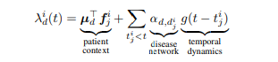

## Constructing Disease Network and Temporal Progression Model via Context-Sensitive Hawkes Process
### 1. Abstract
建模疾病的关系和时序的过程是健康分析的两个主要的问题，因为数据和方法的缺陷目前还没有被一起研究过，但是目前的 EHR (Electronic Health Record) 被大量的采用，所以在这个数据集的基础上文章提出了 `多元上下文敏感的 Hawkes` or `cHawk` 方法，同时推断疾病之间的关系和时序过程。
除了学习疾病网络和时间进展模型外，`cHawk` 还能够根据患者的病史预测特定患者未来可能患其他相关疾病的时间，从而在预测健康分析、公共卫生政策制定和定制患者护理方面有许多潜在的应用。

### 2. Introduction
医疗分析领域存在两个主要的问题
1. 疾病关系发现: 疾病之间的时序关系是什么
2. 时间进展模型: 随着时间的推移，不同患者的不同疾病是如何随着时间发展的

传统使用 point progress 的方法比如 Hawkes process (一种建模有限时序时间集合，考虑了之前所有事件的和当前事件的关系，建模了之前的事件对当前事件发生的概率预测)。但是传统的 Hawkes 过程没有考虑每一个病人独立的情况，比如胖瘦，年龄等等。

1. `cHawkes` 方法的提出，同时学习疾病之间的时序关系和时间进展情况。
2. `cHawkes` 可以捕获疾病关系的全局信息以及用户个人的特征如何影响发病率
3. `cHawkes` 可以生成稀疏可解释的模型
4. 我们通过将 `cHawk` 应用于真实的EHR数据集，发现了具有临床意义的疾病关系网络，并使用所提出的模型为个体患者进行了准确的风险预测

### 3. Related Work
1. Disease Relationship Discovery  
   之前的疾病如何影响当前的疾病的发病率，目前的模型在时间的维度上存在限制，有人使用过 MDP 建模，但是仍然要求时间是离散的。也有人使用连续时间 HMM 捕捉疾病关系，但是因为计算复杂度很高只能捕捉最近的事件。也有人使用 NLP 的相关技术，但是不能捕获到准确的事件间隔。新提出的方法中使用了特定的患者特征(随着时序过程改变)并具有临床意义。
2. Temporal Progression Model
   大量的现在工作在建模患者和疾病的时序关系，但是目前的工作只聚焦于一个特殊的疾病上。
3. Point Process
   `Hawkes process` 在社会学和社交媒体网络上分析很常用，有人使用该方法预测了帮派冲突和恐怖活动。也有人使用该方法预测了邮件交互和日常对话。但是没有人使用该方法学习对疾病关系建模。
4. Network Diffusion Modeling
   使用网络扩散模型发现疾病之间的关系是一个研究的热点。

### 4. Hawkes Process
Hawkes Process 是一种建模时序事件序列例如 EHR 一个患者的诊断事件 的点估计的方法。这个方法背后的直觉是 `自激`，过去事件的发生使得未来的事件更有可能性。传统的 `Hawkes` 只能对一个事件考虑，使用 multi-dimensinal Hawkes Process 可以解决这个问题。但是存在问题:
1. 没有考虑患者个性，不能做出针对患者的评估
2. 计算量巨大，并且很容易过拟合。

### 5. Context-Sensitive Hawkes Process
建模的出发点有3个
1. 患者上下文敏感的发病率
2. 疾病之间的关系，比如互相影响发病率
3. 疾病的动态时序过程

EHR 数据集的组织 $\{T^1,...,T^{|c|}\}$
其中 $T^i$ 是 $i$ 患者的时序数据。
$T^i=\{(t^i_j,d^i_j,f^i_j)\}$ 其中 $t^i_j$ 的含义是第 $j$ 次看病时间, $d^i_j$ 是疾病的类型, $f_j^i$ 是患者的身体特征，比如身高，体重，血压等等。为了简单起见 $f_j^i$ 都是 binary value。

1. patient context: 建模为线性组合
2. disease network: 不尝试学习每一个单独病人的 network，计算全局的。
3. temporal dynamics: 

